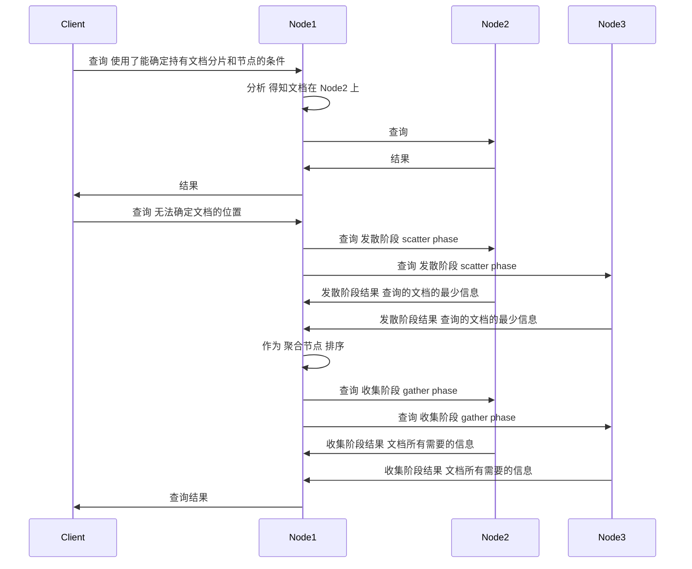

## simple overview

### ES支持的两种查询

- `基本查询` 
- `复合查询` 
- `过滤查询`

### 简单查询

```shell
curl -XGET 'es:9200/index_name/type_name/_search?q=k1:v1'
curl -XGET 'es:9200/index_name/type_name/_search' -d '{
    "query": {
        "query_string": {
            "query": "k1:v1"
        }
    }
}'
```

### 分页，记录大小和文档版本值

```shell
# 从1220个文档开始，返回20个文档 <strong>不包含第1220个文档</strong>
# 返回文档的版本值
curl -XGET 'es:9200/index_name/type_name/_search' -d '{
    "from": 1220,
    "size": 20,
    "version": true,
    "query": {
        "query_string": {
            "query": "k1:v1"
        }
    }
}'
```

### 限制得分

```shell
# 只返回得分大于等于 0.75 的文档
curl -XGET 'es:9200/index_name/type_name/_search' -d '{
    "min_score": 0.75,
    "query": {
        "query_string" {
            "query": "k1:v1"
        }
    }
}'
```

### 选择要返回的字段 Q2A 性能问题

```shell
# 只返回 field1 field2 field3
curl -XGET 'es:9200/index_name/type_name/_search' -d '{
    "fields": [
        "field1",
        "field2",
        "field3"
    ],
    "query": {
        "query_string": {
            "query": "k1:v2"
        }
    }
}'
```

> 可以看到，一切按预期工作。与你分享以下3点：
>
> - 如果没有定义fields数组，它将用默认值，如果有就返回_source字段；_
> - 如果使用_source字段，并且请求一个没有存储的字段，那么这个字段将从_source字
>   段中提取（然而，这需要额外的处理）；
> - 如果想返回所有的存储字段，只需传入星号（*）作为字段名字。
> - 从性能的角度，返回_source字段比返回多个存储字段更好。

### 使用脚本字段

```json
{
    "script_fields": {
        "field_want_to_return": {
            "script": "doc['doc_field_name'].value - 1800"
        }
    },
    "query": {
        "query_string": {
            "query": "key:value"
        }
    }
}
```

## 查询过程

### 默认的查询逻辑



`发散阶段` `收集阶段`

### 搜索类型

- `query_then_fetch` 默认的搜索类型
- `query_and_fetch` 在每个分片上进行搜索，每个分片都返回size个文档
- `dfs_query_and_fetch` 比 `query_and_fetch` 增加了计算分布式词频的阶段，使结果更加的精确
- `dfs_query_then_fetch` 比 `query_then_fetch` 增加了计算分布式词频的阶段，使结果更加的精确
- `count` 只返回文档的个数
- `scan` 返回一个游标，用于进行需要返回大量文档的查询

```shell
curl -XGET 'http://es:9200/index_name/type_name/_search?search_type=count' -d '{
    "query": {
        "term": {
            "field_key": "field_value"
        }
    }
}'
```

### 搜索偏好 *控制查询在哪个分片上进行*

- `_primary` 只在 `主分片` 上查询，可以返回最新的、还未同步到 `副本分片` 上的数据
- `_primary_first` 如果 `主分片` 可用，就使用 `主分片` ，否则使用 `副本分片`
- `_local` **在可能的情况下** ，只在发送请求的节点上的可用分片执行搜索
- `_only_node:node_id` 只在 `node_id` 中的节点进行搜索
- `_prefer_node:node_id` 当给出的节点不可用时，才尝试使用其他节点
- `_shards:1,2` 在给定的分片上进行搜索
- `自定义的值` **给定相同的值的时候在同一个分片上进行搜索** Q2A

```shell
curl -XGET 'http://es:9200/index_name/type_name/_search?preference=搜索偏好' -d '{
    "query": {
        "term": {
            "field_key": "field_value"
        }
    }
}'
```


## 参考

- 《Elasticsearch服务器开发（第二版）》