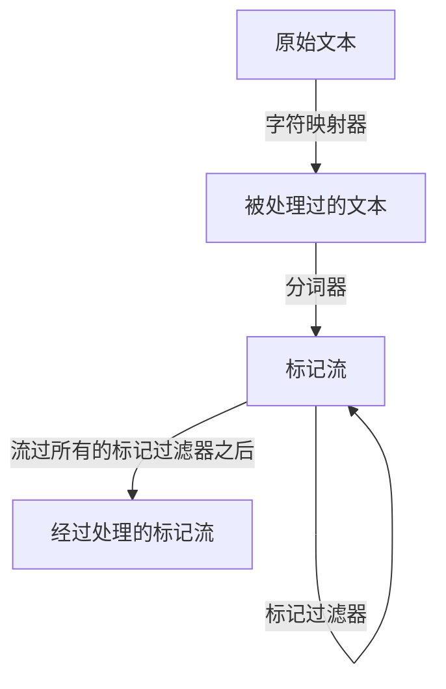
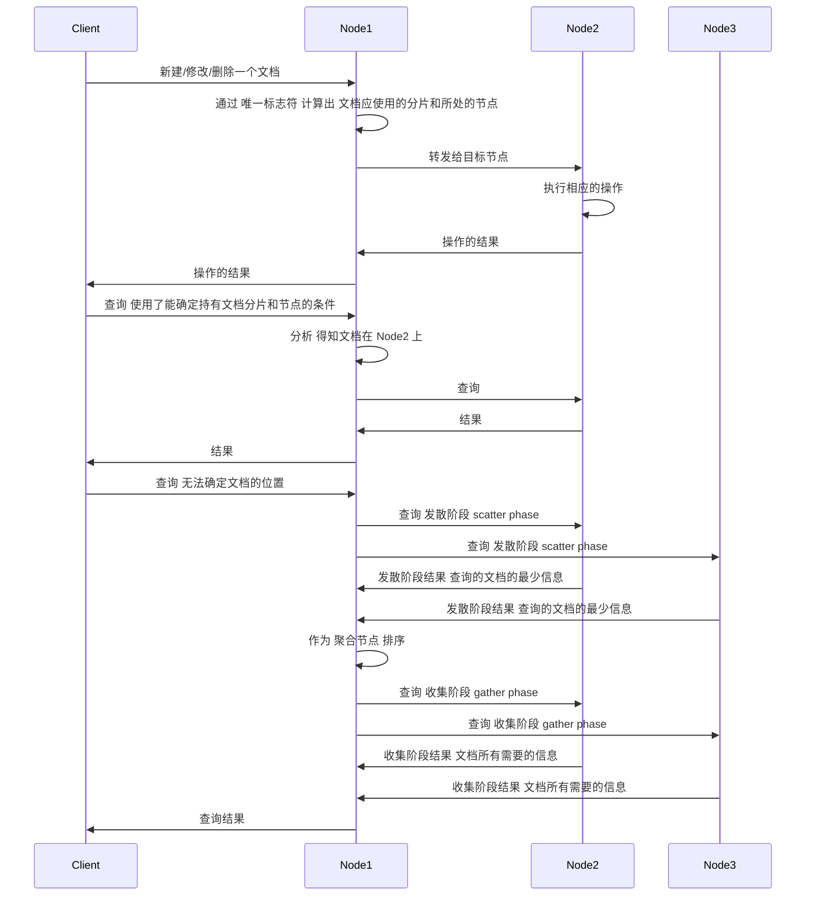

---
categories:
  - elasticsearch-and-lucene
---
# 简介

*Elasticsearch 6.3*

[TOC]

## Elasticsearch

Elasticsearch是 **高度可扩展** 的 **全文搜索和分析引擎**

### 概念

#### 索引 index

- es将数据存储在索引中
- 可以向索引中写入文档、从索引中读取文档
- 索引不存储原始数据
- **类比于sql中的数据库**

#### 文档 document

- 文档是es的主要实体
- 由 **字段** 构成 字段可以有 **一个或者多个值** 
- **一个索引中的所有不同类型文档的相同字段类型一定要相同**
- 文档没有特别的规则 类似于 **JSON对象**
- **类比于sql中的行**

#### 类型 type

- 每个文档都有与之对应的类型定义
- **一个索引中可以存储多种文档类型**
- 能够根据类型提供不同的 **映射**
- **类比于sql中的表**

#### 映射 mapping

- 存储 `分析` 所需的所有信息，包括 字段的信息 等
- 每个文档类型都有自己的映射，就算没有定义

#### 节点 node

- 一个es服务实例称为一个节点

#### 集群 cluster

- 多个 **协同工作** 的es节点称为集群
- **集群允许系统存储超过单机容量的数据**

#### 分片 shard

- *（为了实现存储超过单机容量的数据）es将数据分布到多个Lucene索引上* ，这些 **Lucene索引** 称为 **分片**
- **散布分片的过程称为 分片处理 sharding**
- **分片的数量在索引建立的时候就确定好了**

#### 副本 replica

- *（为了解决访问压力过大单机无法承受的问题）*为每个分片创建冗余的 **副本** *（分布在不同的节点上）*
- 同时，避免了单点问题
- 其中有 `主分片 primary shard` 负责 **更改索引**  ，其他称为 `副本分片 replica shard` 
- 当 `主分片` 不可用时，会从 `副本分片` 中选择一个作为 `主分片`

### 关键特性

#### 分布式的工作模式

#### 对等架构

- 避免单点故障
- 自动进行索引分片的复制

#### 易于增加新的节点到集群

#### 准实时搜索和版本同步

- 查询延迟和临时数据不一致是 **难以避免的** es提供 *尽力而为的优化*
- es提供了 **额外** 机制用于版本同步

## Lucene

> 一个全文检索库

### 概念

#### 索引 index *要区分Lucene和ES的索引*

- lucene 将所有写入索引的信息组织为 **倒排索引 inverted index**
  - 以 **词项** 作为键值
  - 存储 词项 出现的次数 和 出现的位置
- 索引由由多个 **段** 组成
  - 一个段就是一个倒排索引
  - 针对一个索引的搜索，每个段都会进行搜索，然后合并成当前索引搜索的结果
  - **写一次，读多次** 段只有在创建的时候进行写入，然后就不再更新，需要更新/删除文档的时候将会被记录在单独的文件中，而不是修改段 *（更新的时候将会直接将原有文档标记删除，新建一个文档）*
  - 段可以合并，在被强制或者Lucene决定的时候
  - 段数量和搜索速度成反比

#### 文档 document

- 索引与搜索的主要数据载体
- 包含一个或多个字段

#### 字段 field

- 文档的一个片段
- 包含 **字段的名称** 和 **字段的内容**

#### 词项 term

- **搜索时的一个单位**
- 代表文本中的一个词

#### 词条 tokens

- 词项 在 字段文本 中的 **一次出现**
- $<词项的文本, 开始的偏移, 结束的偏移, 词条的类型>$

## ES对数据的操作

### 分析

#### 什么是分析

- 传入的文档转化为倒排索引
- 查询文本变成可被搜索的词
- **这种数据转化的过程称为分析**

#### 谁来进行分析

- **分析器** 完成分析
- **分析器** 由 **一个分词器 tokenizer** 和 **若干个标记过滤器 token filter** 和 **若干个字符映射器 character mapper** 组成

#### 分析的流程

### 评分和查询相关性

#### 什么是评分 scoring

评分时根据文档和查询的匹配度用计分公式计算的结果

> 默认情况下，Lucene使用TF/IDF(term frequency/inverse document frequency 词频/逆向文档频率)评分机制

### 索引的建立和搜索

## 参考

- [Elasticsearch 6.3 official document](https://www.elastic.co/guide/en/elasticsearch/reference/6.4/index.html)
- [《Elasticsearch服务器开发 第二版》](http://e.jd.com/30334773.html)
- [《深入理解Elasticsearch 第二版》](http://item.jd.com/12203786.html)
- [Understanding Segments in Elasticsearch](https://stackoverflow.com/questions/15426441/understanding-segments-in-elasticsearch)
