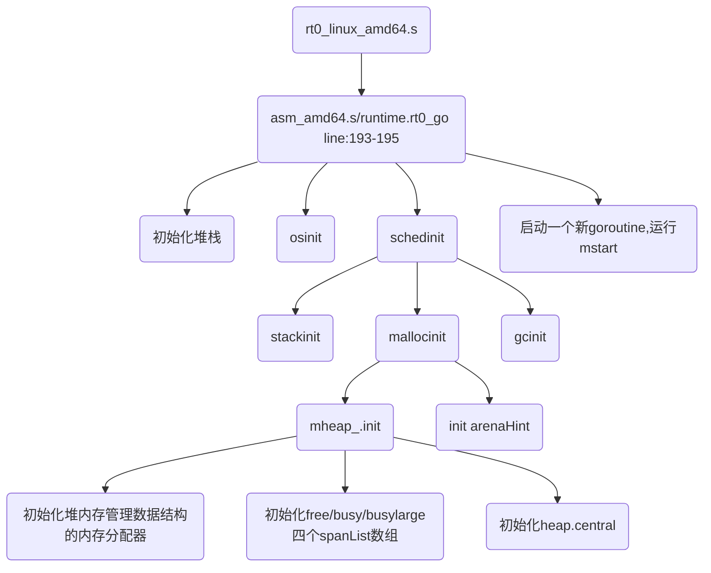

# GO的初始化

[TOC]

```mermaid
graph TD
  0(rt0_linux_amd64.s) --> 1
	1(asm_amd64.s/runtime.rt0_go line:193-195) --> 3(osinit)
	1 --> 2(初始化堆栈)
	1 --> 4(schedinit)
	4 --> 41(stackinit)
	4 --> 42(mallocinit)
	42 --> 421(mheap_.init)
	421 --> 4211(初始化堆内存管理数据结构的内存分配器)
	421 --> 4212(初始化free/busy/busylarge四个spanList数组)
	421 --> 4213(初始化heap.central)
	42 --> 422(init arenaHint)
	4 --> 43(gcinit)
	1 --> 5(启动一个新goroutine,运行mstart)
```

