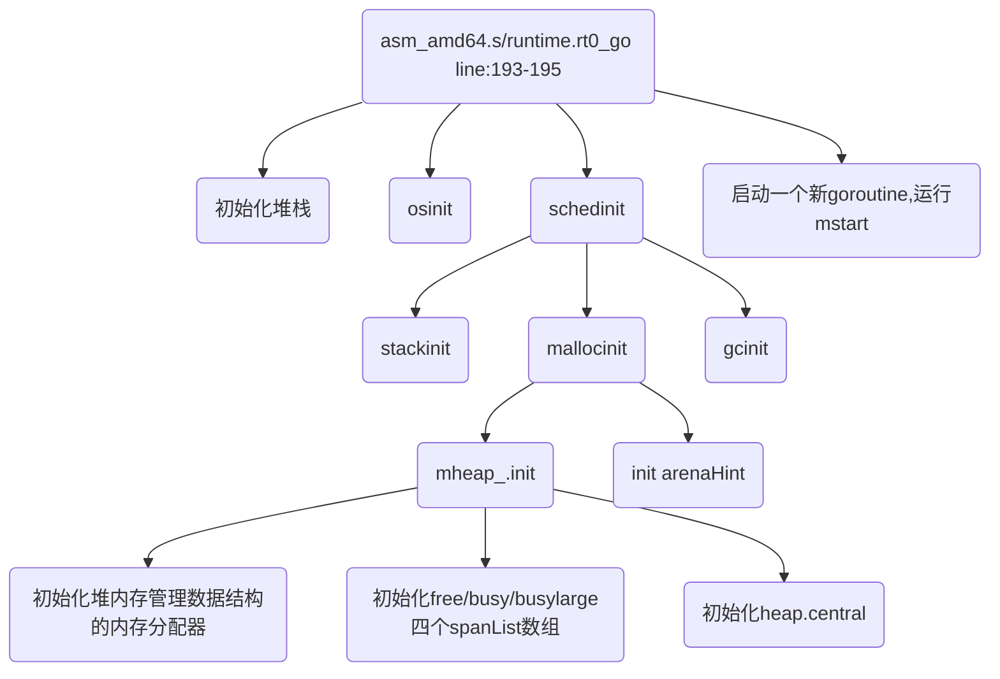
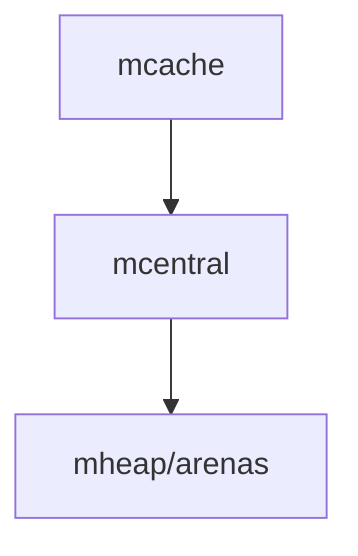
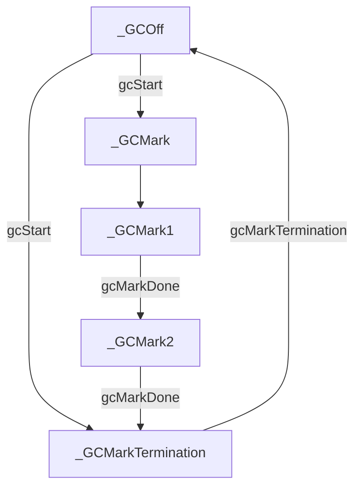
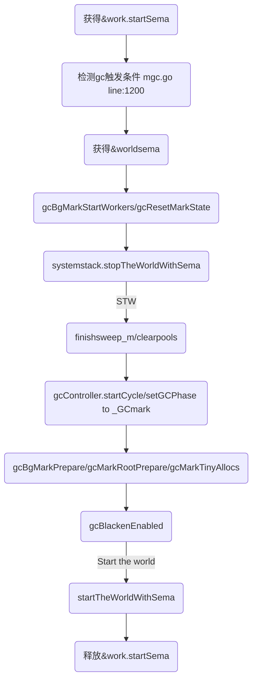
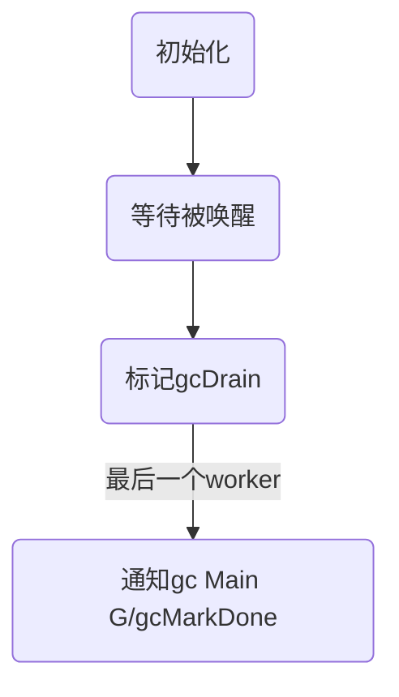
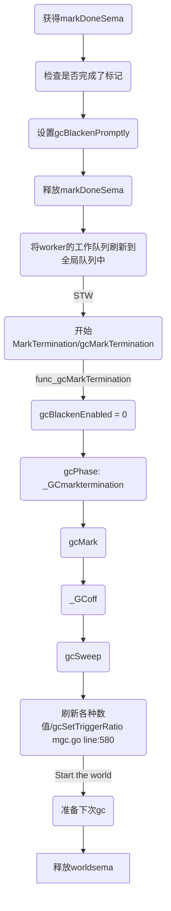

# 内存管理

[TOC]

## 准备

### go程序的初始化流程



### spanClass与spanSize

spanClass = spanSize + scan/noscan

## allocator的数据结构

主allocator管理一系列内存页面。

对于小尺寸的内存分配（小于等于32kB），将会在67种尺寸的内存片中取得最贴合的内存片。每一种尺寸的内存片有自己的空闲内存片集合。任何未使用的内存页可以被分割为一种尺寸的内存片的集合，利用bitmap进行管理。




### fixalloc

一个空闲列表内存分配器，用于管理固定尺寸的堆外对象。用来管理allocator使用的存储。

```go
type fixalloc struct {
    size   uintptr // 此实例分配的内存块的大小
    first  func(arg, p unsafe.Pointer) // called first time p is returned
    arg    unsafe.Pointer // 用于callback的参数
    list   *mlink
    chunk  uintptr // use uintptr instead of unsafe.Pointer to avoid write barriers
    nchunk uint32
    inuse  uintptr // 由此fixalloc分配出去的内存大小
    stat   *uint64
    zero   bool // zero allocations
}
```

#### func (f *fixalloc) init(size uintptr, first func(arg, p unsafe.Pointer), arg unsafe.Pointer, stat *uint64)

初始化fixalloc实例的属性

#### func (f *fixalloc) alloc() unsafe.Pointer

分配内存

#### func (f *fixalloc) free(p unsafe.Pointer)

回收内存

### mheap

用于管理页粒度的内存。

```go
type mheap struct {
    lock      mutex
    free      [_MaxMHeapList]mSpanList // 以page数为单位的list，有span的最大页数的限制
    freelarge mTreap                   // 对于大于_MaxMHeapList的span有mTreap代替存储
    busy      [_MaxMHeapList]mSpanList // 
    busylarge mSpanList                // 
    sweepgen  uint32                   // sweep generation, see comment in mspan
    sweepdone uint32                   // all spans are swept
    sweepers  uint32                   // number of active sweepone calls

    // 保存了全部的mspan
    allspans []*mspan // all spans out there

    // 用于gc。两个栈分别保存已经清理过的spans和未清理过的spans
    // sweepgen每次增加2，两个spans栈交换角色，
    // sweep过的span被弹出到另一个栈
    sweepSpans [2]gcSweepBuf

    // Proportional sweep
    //
    // These parameters represent a linear function from heap_live
    // to page sweep count. The proportional sweep system works to
    // stay in the black by keeping the current page sweep count
    // above this line at the current heap_live.
    //
    // The line has slope sweepPagesPerByte and passes through a
    // basis point at (sweepHeapLiveBasis, pagesSweptBasis). At
    // any given time, the system is at (memstats.heap_live,
    // pagesSwept) in this space.
    //
    // It's important that the line pass through a point we
    // control rather than simply starting at a (0,0) origin
    // because that lets us adjust sweep pacing at any time while
    // accounting for current progress. If we could only adjust
    // the slope, it would create a discontinuity in debt if any
    // progress has already been made.
    pagesInUse         uint64  // pages of spans in stats _MSpanInUse; R/W with mheap.lock
    pagesSwept         uint64  // pages swept this cycle; updated atomically
    pagesSweptBasis    uint64  // pagesSwept to use as the origin of the sweep ratio; updated atomically
    sweepHeapLiveBasis uint64  // value of heap_live to use as the origin of sweep ratio; written with lock, read without
    sweepPagesPerByte  float64 // proportional sweep ratio; written with lock, read without
    // TODO(austin): pagesInUse should be a uintptr, but the 386
    // compiler can't 8-byte align fields.

    // Malloc stats.
    largealloc  uint64                  // bytes allocated for large objects
    nlargealloc uint64                  // number of large object allocations
    largefree   uint64                  // bytes freed for large objects (>maxsmallsize)
    nlargefree  uint64                  // number of frees for large objects (>maxsmallsize)
    nsmallfree  [_NumSizeClasses]uint64 // number of frees for small objects (<=maxsmallsize)
    
    // heapArena映射表 二级映射 arenaIdx -> heapArena
    // heapArena保存了一个arena全部word的pointer/scalar bitmap和一个pageId -> *mspan映射表
    arenas [1 << arenaL1Bits]*[1 << arenaL2Bits]*heapArena

    // arenaHint链表，每个arenaHint保存一个可能的、用于扩张arena的地址
    // 地址随着实际分配的arena变化
    arenaHints *arenaHint

    // mcentral映射表 spanClass -> mcentral
    central [numSpanClasses]struct {
        mcentral mcentral
        pad      [sys.CacheLineSize - unsafe.Sizeof(mcentral{})%sys.CacheLineSize]byte
    }
    // ... 内存管理组件的fixalloc
}
```


### mspan

双向列表，承载一种sizeclass和noscan/scan的obj容器

```go
type mspan struct {
    next *mspan     // next span in list, or nil if none
    prev *mspan     // previous span in list, or nil if none
    list *mSpanList // For debugging. TODO: Remove.

    startAddr uintptr // address of first byte of span aka s.base()
    npages    uintptr // number of pages in span

    manualFreeList gclinkptr // list of free objects in _MSpanManual spans

    // freeindex is the slot index between 0 and nelems at which to begin scanning
    // for the next free object in this span.
    freeindex uintptr
    // TODO: Look up nelems from sizeclass and remove this field if it
    // helps performance.
    nelems uintptr // number of object in the span.

    // Cache of the allocBits at freeindex. allocCache is shifted
    // such that the lowest bit corresponds to the bit freeindex.
    // allocCache holds the complement of allocBits, thus allowing
    // ctz (count trailing zero) to use it directly.
    // allocCache may contain bits beyond s.nelems; the caller must ignore
    // these.
    allocCache uint64

    // allocBits and gcmarkBits hold pointers to a span's mark and
    // allocation bits. The pointers are 8 byte aligned.
    // There are three arenas where this data is held.
    // free: Dirty arenas that are no longer accessed
    //       and can be reused.
    // next: Holds information to be used in the next GC cycle.
    // current: Information being used during this GC cycle.
    // previous: Information being used during the last GC cycle.
    // A new GC cycle starts with the call to finishsweep_m.
    // finishsweep_m moves the previous arena to the free arena,
    // the current arena to the previous arena, and
    // the next arena to the current arena.
    // The next arena is populated as the spans request
    // memory to hold gcmarkBits for the next GC cycle as well
    // as allocBits for newly allocated spans.
    //
    // The pointer arithmetic is done "by hand" instead of using
    // arrays to avoid bounds checks along critical performance
    // paths.
    // The sweep will free the old allocBits and set allocBits to the
    // gcmarkBits. The gcmarkBits are replaced with a fresh zeroed
    // out memory.
    allocBits  *gcBits
    gcmarkBits *gcBits

    // sweep generation:
    // if sweepgen == h->sweepgen - 2, the span needs sweeping
    // if sweepgen == h->sweepgen - 1, the span is currently being swept
    // if sweepgen == h->sweepgen, the span is swept and ready to use
    // h->sweepgen is incremented by 2 after every GC

    sweepgen    uint32
    divMul      uint16     // for divide by elemsize - divMagic.mul
    baseMask    uint16     // if non-0, elemsize is a power of 2, & this will get object allocation base
    allocCount  uint16     // number of allocated objects
    spanclass   spanClass  // size class and noscan (uint8)
    incache     bool       // being used by an mcache
    state       mSpanState // mspaninuse etc
    needzero    uint8      // needs to be zeroed before allocation
    divShift    uint8      // for divide by elemsize - divMagic.shift
    divShift2   uint8      // for divide by elemsize - divMagic.shift2
    elemsize    uintptr    // computed from sizeclass or from npages
    unusedsince int64      // first time spotted by gc in mspanfree state
    npreleased  uintptr    // number of pages released to the os
    limit       uintptr    // end of data in span
    speciallock mutex      // guards specials list
    specials    *special   // linked list of special records sorted by offset.

```


### mcentral

收集一个给定尺寸的内存片的所有span

```go
type mcentral struct {
    lock      mutex
    spanclass spanClass // 存储的span的规格
    nonempty  mSpanList // 有空闲槽位的span列表
    empty     mSpanList // 没有空闲槽位或者放置在mcache中的span列表

    // nmalloc is the cumulative count of objects allocated from
    // this mcentral, assuming all spans in mcaches are
    // fully-allocated. Written atomically, read under STW.
    nmalloc uint64
}
```

#### func (c *mcentral) cacheSpan() *mspan 

将一个span移交到mcache中

操作分两个阶段，阶段一尝试获得一个有槽位的mspan，并且放置到empty列表的尾部。阶段二检查获得到的span和相应的数据统计。

todo

#### func (c *mcentral) uncacheSpan(s *mspan) 

从mcache中回收一个span

1. 获得mcentral的锁
2. 修改s.incache
3. 判断s上是否还有已经分配出去的object
   1. 如果没有，throw
4. 计算是否有空闲槽位
   1. 如果有，将s从empty移动到nonempty中
5. 释放锁

#### func (c *mcentral) freeSpan(s *mspan, preserve bool, was empty bool) bool

1. 检查是否在mcache中
2. 将span的needzero置1
3. 特别的针对preserve进行检查
   1. 检查span.inList()
   2. 修改span的sweepgen为mheap_的sweepgen
   3. 退出
4. 检查wasempty todo
5. 检查span上是否还有被占用的对象
   1. 如果有，推出
6. span全部槽位都空闲，则移出central，返回给mheap_

#### func (c *mcentral) grow() *span

从mheap申请一个新的mspan，并初始化mspan

### mcache

每个m各自拥有的空闲mspans缓存

```go
type mcache struct {
    // The following members are accessed on every malloc,
    // so they are grouped here for better caching.
    next_sample int32   // trigger heap sample after allocating this many bytes
    local_scan  uintptr // bytes of scannable heap allocated

    // Allocator cache for tiny objects w/o pointers.
    // See "Tiny allocator" comment in malloc.go.

    tiny             uintptr // 当前用于存储tiny对象的槽位
    tinyoffset       uintptr
    local_tinyallocs uintptr // number of tiny allocs not counted in other stats

    // The rest is not accessed on every malloc.

    alloc [numSpanClasses]*mspan // 缓存的spans，以spanClass为索引

    stackcache [_NumStackOrders]stackfreelist

    // Local allocator stats, flushed during GC.
    local_largefree  uintptr                  // bytes freed for large objects (>maxsmallsize)
    local_nlargefree uintptr                  // number of frees for large objects (>maxsmallsize)
    local_nsmallfree [_NumSizeClasses]uintptr // number of frees for small objects (<=maxsmallsize)
}
```


### mstats

内存分配统计

## 内存分配流程

### 分配一个小尺寸的内存片

1. **（无锁）**先四舍五入到规定的尺寸，然后查看每个m自己的mcache中的对应的mspan是否有空闲的插槽，如果有就分配成功。
2. 如果对应的mspan没有空间了，就向mcentral请求有空闲的mspan。这会导致**mcentral加锁**，如果一次性请求一整个span会摊销mcentral加锁的成本。
3. 如果mcentral中需要的尺寸的内存片不存在有空闲的mspan，将会向mheap请求一组内存页来创建mspan。
4. 如果mheap中没有空闲的页面或者没有足够多的连续页面，将会通过系统调用获得至少1MB的内存。一次性申请更大的内存将会摊销系统调用的成本。

### 清理mspan

### 大内存直接在堆上分配和回收

## virtual memory layout

### arena

- heap由一组arenas组成。

- 每个arena的大小固定(heapArenaBytes)，且每个arena的起始地址对齐arena的尺寸。
- 每个arena有一个关联的heapArena对象，保存了arena的元数据。
  - 存储了所有words的heap bitmap
  - 存储了每个span的页的span map
  - heapArena是堆外分配的

### heap

- 由于arena是对齐的，所以heap所代表的地址空间可以被认为是arena帧组成的。
- arena map *(mheap_.arenas)*用来存储arena帧的编号和对应的heapArena指针的映射。
  - 如果映射的值是nil，意味着对应的地址空间不被heap_支持?_
  - arena map被设计为是两级数组，一个L1和许多L2。但因为arenas非常大，在很多架构的机器上，可能只包含一个巨大的L2 map。
- arena map（中的arenas）覆盖了整个可能的地址空间，这样的设计允许go的堆使用任何一部分内存地址空间。内存分配器尝试让arena互相连续，以帮助大尺寸的span或大对象能够跨arena分配。

## 初始化流程

```go
// 1.11.4
// src/runtime/proc.go
func schedinit() {
  // ...
  stackinit()
  mallocinit()
  // ...
}

//////////////////////////////////////////////////////
// src/runtime/stack.go                             //
//////////////////////////////////////////////////////
// Global pool of spans that have free stacks.
// Stacks are assigned an order according to size.
//     order = log_2(size/FixedStack)
// There is a free list for each order.
// TODO: one lock per order?
var stackpool [_NumStackOrders]mSpanList
var stackpoolmu mutex

// Global pool of large stack spans.
var stackLarge struct {
    lock mutex
    free [heapAddrBits - pageShift]mSpanList // free lists by log_2(s.npages)
}
func stackinit() {
		if _StackCacheSize&_PageMask != 0 {
        throw("cache size must be a multiple of page size")
    }
  // stackpool 是一个mSpanList数组
    for i := range stackpool {
        stackpool[i].init()
    }
  // stackLarge.free是一个mSpanList
    for i := range stackLarge.free {
        stackLarge.free[i].init()
    }
}
//////////////////////////////////////////////////////
// stack.go end                                     //
//////////////////////////////////////////////////////

//////////////////////////////////////////////////////
// src/runtime/malloc.go                            //
//////////////////////////////////////////////////////
func mallocinit() {
  // 检查一些参数是否符合预期
  // init heap
  mheap_.init() // mheap.go
  
  _g_.m.mcache = allocmcache() // 为当前运行的machine初始化一个mcache
  
  // 初始化mheap_.arenaHints
  // 检查运行环境，针对不同的运行环境初始化不同的arenaHints
  // 根据运行环境，计算出arena的基础地址p
  hint := (*arenaHint)(mheap_.arenaHintAlloc.alloc())
  hint.addr = p
  hint.next, mheap_.arenaHints = mheap_.arenaHints, hint
}

func (h *mheap) init() {
  // 初始化heap的各个组件的fixalloc
  h.treapalloc.init(unsafe.Sizeof(treapNode{}), nil, nil, &memstats.other_sys) // fixalloc
    h.spanalloc.init(unsafe.Sizeof(mspan{}), recordspan, unsafe.Pointer(h), &memstats.mspan_sys) // fixalloc
    h.cachealloc.init(unsafe.Sizeof(mcache{}), nil, nil, &memstats.mcache_sys) // fixalloc
    h.specialfinalizeralloc.init(unsafe.Sizeof(specialfinalizer{}), nil, nil, &memstats.other_sys) // fixalloc
    h.specialprofilealloc.init(unsafe.Sizeof(specialprofile{}), nil, nil, &memstats.other_sys) // fixalloc
    h.arenaHintAlloc.init(unsafe.Sizeof(arenaHint{}), nil, nil, &memstats.other_sys) // fixalloc
  
    // Don't zero mspan allocations. Background sweeping can
    // inspect a span concurrently with allocating it, so it's
    // important that the span's sweepgen survive across freeing
    // and re-allocating a span to prevent background sweeping
    // from improperly cas'ing it from 0.
    // 帮助gc避免将正在分配的span内存块回收掉
    // This is safe because mspan contains no heap pointers.
    // 因为mspan中没有heap指针（不会导致memory leak？）
    h.spanalloc.zero = false

    // h->mapcache needs no init
    for i := range h.free {
        // 初始化两个mSpanList
        h.free[i].init()
        h.busy[i].init()
    }

    h.busylarge.init()
    for i := range h.central {
        // 初始化mcentral
        h.central[i].mcentral.init(spanClass(i))
    }
}
//////////////////////////////////////////////////////
// malloc.go end                                    //
//////////////////////////////////////////////////////
```

## 在堆上分配对象

```go
//////////////////////////////////////////////////////
// malloc.go                                        //
//////////////////////////////////////////////////////
func newobject(typ *_type) unsafe.Pointer {
    return mallocgc(typ.size, typ, true)
}
//////////////////////////////////////////////////////
// type.go                                          //
//////////////////////////////////////////////////////
type _type struct {
    size       uintptr
    ptrdata    uintptr // size of memory prefix holding all pointers
    hash       uint32
    tflag      tflag
    align      uint8
    fieldalign uint8
    kind       uint8
    alg        *typeAlg
    // gcdata stores the GC type data for the garbage collector.
    // If the KindGCProg bit is set in kind, gcdata is a GC program.
    // Otherwise it is a ptrmask bitmap. See mbitmap.go for details.
    gcdata    *byte
    str       nameOff
    ptrToThis typeOff
}
//////////////////////////////////////////////////////
// type.go end                                      //
//////////////////////////////////////////////////////

//////////////////////////////////////////////////////
// malloc.go
//////////////////////////////////////////////////////
// 小对象在mcache和mcentral中分配
func mallocgc(size uintptr, typ *_type, needzero bool) unsafe.Pointer {
	// ...
	if size == 0 {
		return unsafe.Pointer(&zerobase) // 如果分配的内存大小为0，分配一个常量
	}

	// ...
	// 平衡gc和内存分配，根据条件判断是否将请求分配的G协助gc
	// Set mp.mallocing to keep from being preempted by GC.
	// ...
  
	c := gomcache()
	var x unsafe.Pointer
	noscan := typ == nil || typ.kind&kindNoPointers != 0 // 是否有堆上指针 没有的话就分配在noscan的span中
	if size <= maxSmallSize {
		if noscan && size < maxTinySize {
			// Tiny对象内存分配器
			off := c.tinyoffset // c -> m.mcache off 当前tiny使用的内存针对obj的base的offset
			// 对齐地址
			if size&7 == 0 {
				off = round(off, 8)
			} else if size&3 == 0 {
				off = round(off, 4)
			} else if size&1 == 0 {
				off = round(off, 2)
			}
			if off+size <= maxTinySize && c.tiny != 0 {
				// 现在的obj能够存储下当前的tiny对象
				x = unsafe.Pointer(c.tiny + off)
				// .. 修改统计数据等
				mp.mallocing = 0
				releasem(mp)
				return x
			}
			// 不能够满足时，重新获取一个obj来存储新的tiny对象
			span := c.alloc[tinySpanClass]
			v := nextFreeFast(span) // 找到span的下一个空闲obj槽位
			if v == 0 {
        // 没有找到空闲obj，通知mcache，获取一个新的槽位
				v, _, shouldhelpgc = c.nextFree(tinySpanClass)  // v gclinkptr
			}
			x = unsafe.Pointer(v)
			(*[2]uint64)(x)[0] = 0
			(*[2]uint64)(x)[1] = 0
			// 根据现有的和原有的tiny obj的剩余空间决定保留哪一个obj作为mcache的tiny
			if size < c.tinyoffset || c.tiny == 0 {
				c.tiny = uintptr(x)
				c.tinyoffset = size
			}
			size = maxTinySize
		} else {
      // 小对象的分配
			var sizeclass uint8
      // ... 查表根据对象的大小获取最接近的sizeclass
      // ... 根据sizeclass 获得spanclass
      // ... 根据spanClass和缓存有无空闲槽从mcache获取对应的槽位
			x = unsafe.Pointer(v)
			if needzero && span.needzero != 0 { // 是否需要置零
				memclrNoHeapPointers(unsafe.Pointer(v), size)
			}
		}
	} else { // 大对象分配
		var s *mspan
		shouldhelpgc = true
		systemstack(func() {
			s = largeAlloc(size, needzero, noscan)
		})
		s.freeindex = 1
		s.allocCount = 1
		x = unsafe.Pointer(s.base())
		size = s.elemsize
	}

	var scanSize uintptr
	if !noscan {
		// ... 记录gc需要的扫描信息
	}
  
	// ...

	mp.mallocing = 0
	releasem(mp)
  // ... help gc
	return x
}

//////////////////////////////////////////////////////
//
//////////////////////////////////////////////////////
func (c *mcache) nextFree(spc spanClass) (v gclinkptr, s *mspan, shouldhelpgc bool) {
    s = c.alloc[spc]
    shouldhelpgc = false
    freeIndex := s.nextFreeIndex() // 获取cache中已经有的span，检查是否有空槽位
    if freeIndex == s.nelems {
        // ...
        // 无空槽位，从mcentral获取一个新的span替换当前的span
        systemstack(func() {
            c.refill(spc)
        })
        // ...
    }
    // ...
    v = gclinkptr(freeIndex*s.elemsize + s.base())
    // ...
    return
}

// mcache.go
// 从mcentral获得一个有空位的span，将原有的span交还给mcentral
func (c *mcache) refill(spc spanClass) {
    // 获得现在拥有的span
    s := c.alloc[spc]
    // ...
    if s != &emptymspan {
        s.incache = false // 将span还给mcentral
    }

    // 从mcentral获得一个新的span
    s = mheap_.central[spc].mcentral.cacheSpan() // 根据spanclass获得对应的central
    // ... 对新的span做一些检查
    c.alloc[spc] = s
}

// mcentral.go
// 提供接口将一个span分发给mcache
func (c *mcentral) cacheSpan() *mspan {
    // ... gc 记录分配此次span的成本

    lock(&c.lock) // 因为mcentral会被并发访问，加锁
    // ...
    sg := mheap_.sweepgen
retry:
    var s *mspan
    for s = c.nonempty.first; s != nil; s = s.next { // empty指的是没有槽位空闲
        if s.sweepgen == sg-2 && atomic.Cas(&s.sweepgen, sg-2, sg-1) {
            // 如果当前的span需要被gc，就尝试由当前的G进行清理并分配
            c.nonempty.remove(s)
            c.empty.insertBack(s)
            unlock(&c.lock) // 解锁
            s.sweep(true) // 清理
            goto havespan
        }
        if s.sweepgen == sg-1 {
            // the span is being swept by background sweeper, skip
            continue
        }
        // 当前的span有空闲槽位并且不需要进行gc
        c.nonempty.remove(s)
        c.empty.insertBack(s)
        unlock(&c.lock) // 解锁
        goto havespan
    }

    for s = c.empty.first; s != nil; s = s.next {
        if s.sweepgen == sg-2 && atomic.Cas(&s.sweepgen, sg-2, sg-1) {
            // we have an empty span that requires sweeping,
            // sweep it and see if we can free some space in it
            c.empty.remove(s)
            // swept spans are at the end of the list
            c.empty.insertBack(s)
            unlock(&c.lock) // 解锁 猜测：通过span的回收代数保证并发安全，s.sweepgen作为了一个锁
            s.sweep(true)
            freeIndex := s.nextFreeIndex()
            if freeIndex != s.nelems {
                s.freeindex = freeIndex // 回收之后有空槽位
                goto havespan
            }
            lock(&c.lock)
            // 回收之后也没有空槽位
            goto retry
        }
        if s.sweepgen == sg-1 {
            // the span is being swept by background sweeper, skip
            continue
        }
        // 没有有空闲槽位的span或可能有空闲槽位的span
        break
    }
    // ...
    unlock(&c.lock)

    // 所有的span都是满的，扩充mcentral
    s = c.grow()
    if s == nil {
        return nil
    }
    lock(&c.lock)
    c.empty.insertBack(s)
    unlock(&c.lock)

    // At this point s is a non-empty span, queued at the end of the empty list,
    // c is unlocked.
havespan:
    // ... 记录一些统计数据
    // ... 初始化span
    return s
}

// 从mheap获得一个新的page，并初始化为mcentral需要的spanclass
func (c *mcentral) grow() *mspan {
    // ... 计算尺寸
    s := mheap_.alloc(npages, c.spanclass, false, true)
    // ... 初始化span
    heapBitsForAddr(s.base()).initSpan(s)
    return s
}

// malloc.go
// 大对象分配
func largeAlloc(size uintptr, needzero bool, noscan bool) *mspan {
    // ...
    npages := size >> _PageShift
    if size&_PageMask != 0 {
        npages++
    }

    // 平衡分配内存和gc
    deductSweepCredit(npages*_PageSize, npages)
    // 直接申请span
    s := mheap_.alloc(npages, makeSpanClass(0, noscan), true, needzero)
    // ...
    s.limit = s.base() + size
    heapBitsForAddr(s.base()).initSpan(s)
    return s
}

// mheap.go
func (h *mheap) alloc(npage uintptr, spanclass spanClass, large bool, needzero bool) *mspan {
    var s *mspan
    systemstack(func() {
        s = h.alloc_m(npage, spanclass, large)
    })
    // ... 置零
    return s
}

// 从gc管理的内存中分配新的span需要的页
// 向HeapMap and HeapMapCache中记录sizeclass
func (h *mheap) alloc_m(npage uintptr, spanclass spanClass, large bool) *mspan {
    _g_ := getg()
    // ...
    lock(&h.lock)

    // 平衡分配和gc before allocating n pages
    // we need to sweep and reclaim at least n pages.
    if h.sweepdone == 0 {
        // ...
        h.reclaim(npage)
        // ...
    }

    // transfer stats from cache to global
    memstats.heap_scan += uint64(_g_.m.mcache.local_scan)
    _g_.m.mcache.local_scan = 0
    memstats.tinyallocs += uint64(_g_.m.mcache.local_tinyallocs)
    _g_.m.mcache.local_tinyallocs = 0

    s := h.allocSpanLocked(npage, &memstats.heap_inuse) // 分配内存
    if s != nil { // 初始化span，存储到heap
        // Record span info, because gc needs to be
        // able to map interior pointer to containing span.
        atomic.Store(&s.sweepgen, h.sweepgen)
        h.sweepSpans[h.sweepgen/2%2].push(s) // Add to swept in-use list.
        s.state = _MSpanInUse
        s.allocCount = 0
        s.spanclass = spanclass
        if sizeclass := spanclass.sizeclass(); sizeclass == 0 {
            s.elemsize = s.npages << _PageShift
            s.divShift = 0
            s.divMul = 0
            s.divShift2 = 0
            s.baseMask = 0
        } else {
            s.elemsize = uintptr(class_to_size[sizeclass])
            m := &class_to_divmagic[sizeclass]
            s.divShift = m.shift
            s.divMul = m.mul
            s.divShift2 = m.shift2
            s.baseMask = m.baseMask
        }

        // update stats, sweep lists
        h.pagesInUse += uint64(npage)
        if large {
            memstats.heap_objects++
            mheap_.largealloc += uint64(s.elemsize)
            mheap_.nlargealloc++
            atomic.Xadd64(&memstats.heap_live, int64(npage<<_PageShift))
            // Swept spans are at the end of lists.
            if s.npages < uintptr(len(h.busy)) {
                h.busy[s.npages].insertBack(s)
            } else {
                h.busylarge.insertBack(s)
            }
        }
    }
    // ...
    unlock(&h.lock)
    return s
}

// 给定一个分配好尺寸的span
// The returned span has been removed from the
// free list, but its state is still MSpanFree.
func (h *mheap) allocSpanLocked(npage uintptr, stat *uint64) *mspan {
    var list *mSpanList
    var s *mspan

    // 从fixed-size列表中尝试匹配
    for i := int(npage); i < len(h.free); i++ {
        list = &h.free[i]
        if !list.isEmpty() {
            s = list.first
            list.remove(s)
            goto HaveSpan
        }
    }
    // 从freelarge中寻找大小最匹配的
    s = h.allocLarge(npage)
    if s == nil {
        if !h.grow(npage) { // 如果已经分配的都不符合要求，尝试获取新的内存
            return nil
        }
        s = h.allocLarge(npage) // 重新分配
        if s == nil {
            return nil
        }
    }

HaveSpan:
    // 将span标记为正在使用
    // ... 检查span
    if s.npreleased > 0 {
        sysUsed(unsafe.Pointer(s.base()), s.npages<<_PageShift)
        memstats.heap_released -= uint64(s.npreleased << _PageShift)
        s.npreleased = 0
    }

    if s.npages > npage {
        // 如果分配的页数大于要求的页数，切割多余的页返回给heap
        // ...
    }
    s.unusedsince = 0

    h.setSpans(s.base(), npage, s) // 将s存入heap

    *stat += uint64(npage << _PageShift)
    memstats.heap_idle -= uint64(npage << _PageShift)

    //println("spanalloc", hex(s.start<<_PageShift))
    if s.inList() {
        throw("still in list")
    }
    return s
}

// 尝试一次性获取最少npage页
func (h *mheap) grow(npage uintptr) bool {
    ask := npage << _PageShift
    v, size := h.sysAlloc(ask)
    // ...

    // Create a fake "in use" span and free it, so that the
    // right coalescing happens.
    // ... 通过变换span的使用状态，实现span 之间的合并
    return true
}

// 尝试从freelarge中分配一个最小的满足npage的mspan，如果不存在，返回nil
func (h *mheap) allocLarge(npage uintptr) *mspan {
    // 从treap中搜索最小的适合npage的span
    return h.freelarge.remove(npage) // h.freelarge --> mTreap mgclarge.go 树堆
}

```


## GC

- **CMS** concurrent mark and sweep *use a write barrier*

- non-generational
- non-compacting



gcStart



gcMarker




gcMarkDone




