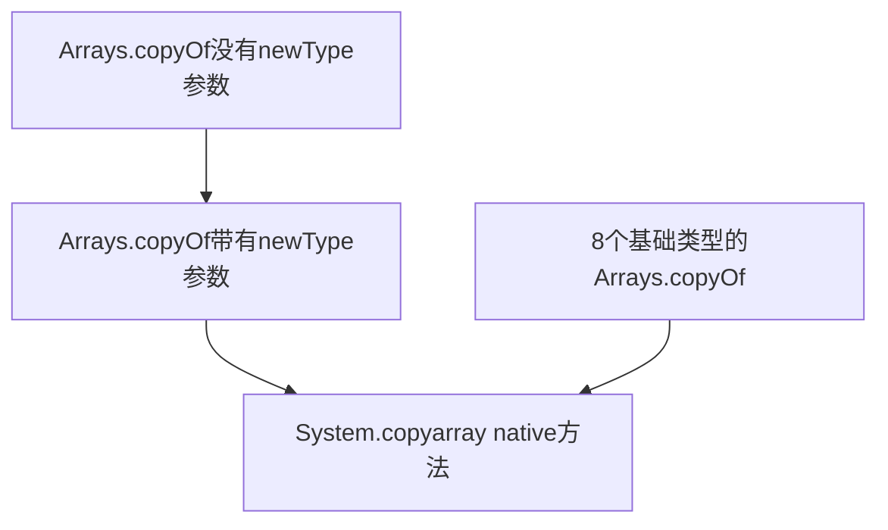
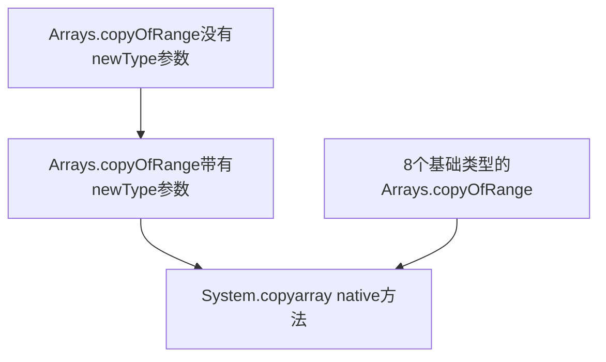

## 拷贝数组的方法

- 手动遍历
- Arrays中的一系列拷贝方法
- System.arraycopy(Object src, int srcPos, Object dest, int destPos, int length)

### 手动遍历

略

### Arrays中的拷贝方法

#### copyOf

从给定的原数组拷贝[0, length)的元素到新的数组，返回新的数组。包括两个泛型方法和八种基础类型的拷贝方法。十种方法底层的实现都是基于System.copyarray(Object src, int srcPos, Object dest, int destPos, int length)实现。

##### 调用逻辑



##### 源码

```java
// java.util.Arrays
// JDK 1.8

// 两个针对泛型的copyOf
@SuppressWarnings("unchecked")
public static <T> T[] copyOf(T[] original, int newLength) {
    return (T[]) copyOf(original, newLength, original.getClass());
}

public static <T,U> T[] copyOf(U[] original, int newLength, Class<? extends T[]> newType) {
    @SuppressWarnings("unchecked")
    T[] copy = ((Object)newType == (Object)Object[].class)
        ? (T[]) new Object[newLength]
        : (T[]) Array.newInstance(newType.getComponentType(), newLength);
    // ^ ^ 利用Class实例化一个数组 ^ ^
    System.arraycopy(original, 0, copy, 0,
                     Math.min(original.length, newLength));
    return copy;
}
// 针对八种基本类型的copyOf
public static byte[] copyOf(byte[] original, int newLength) {
    byte[] copy = new byte[newLength];
    System.arraycopy(original, 0, copy, 0,
                     Math.min(original.length, newLength));
    return copy;
}

public static short[] copyOf(short[] original, int newLength) {
    short[] copy = new short[newLength];
    System.arraycopy(original, 0, copy, 0,
                     Math.min(original.length, newLength));
    return copy;
}

public static int[] copyOf(int[] original, int newLength) {
    int[] copy = new int[newLength];
    System.arraycopy(original, 0, copy, 0,
                     Math.min(original.length, newLength));
    return copy;
}

public static long[] copyOf(long[] original, int newLength) {
    long[] copy = new long[newLength];
    System.arraycopy(original, 0, copy, 0,
                     Math.min(original.length, newLength));
    return copy;
}

public static char[] copyOf(char[] original, int newLength) {
    char[] copy = new char[newLength];
    System.arraycopy(original, 0, copy, 0,
                     Math.min(original.length, newLength));
    return copy;
}

public static float[] copyOf(float[] original, int newLength) {
    float[] copy = new float[newLength];
    System.arraycopy(original, 0, copy, 0,
                     Math.min(original.length, newLength));
    return copy;
}

public static double[] copyOf(double[] original, int newLength) {
    double[] copy = new double[newLength];
    System.arraycopy(original, 0, copy, 0,
                     Math.min(original.length, newLength));
    return copy;
}

public static boolean[] copyOf(boolean[] original, int newLength) {
    boolean[] copy = new boolean[newLength];
    System.arraycopy(original, 0, copy, 0,
                     Math.min(original.length, newLength));
    return copy;
}
```

#### copyOfRange

从给定的原数组中拷贝[from, to]元素作为新数组返回。包括两个针对泛型的方法和八个针对基本类型的方法。实现上都是基于System.arraycopy(src, srcPos, dest, destPos, length)。

##### 调用逻辑



##### 源码

```java
// java.util.Arrays
// JDK 1.8

// 两个针对泛型的方法
public static <T> T[] copyOfRange(T[] original, int from, int to) {
    return copyOfRange(original, from, to, (Class<? extends T[]>) original.getClass());
}

public static <T,U> T[] copyOfRange(U[] original, int from, int to, Class<? extends T[]> newType) {
    int newLength = to - from;
    if (newLength < 0)
        throw new IllegalArgumentException(from + " > " + to);
    @SuppressWarnings("unchecked")
    T[] copy = ((Object)newType == (Object)Object[].class)
        ? (T[]) new Object[newLength]
        : (T[]) Array.newInstance(newType.getComponentType(), newLength);
    System.arraycopy(original, from, copy, 0,
                     Math.min(original.length - from, newLength));
    return copy;
}
// 八种基础类型的方法
public static byte[] copyOfRange(byte[] original, int from, int to) {
    int newLength = to - from;
    if (newLength < 0)
        throw new IllegalArgumentException(from + " > " + to);
    byte[] copy = new byte[newLength];
    System.arraycopy(original, from, copy, 0,
                     Math.min(original.length - from, newLength));
    return copy;
}

public static short[] copyOfRange(short[] original, int from, int to) {
    int newLength = to - from;
    if (newLength < 0)
        throw new IllegalArgumentException(from + " > " + to);
    short[] copy = new short[newLength];
    System.arraycopy(original, from, copy, 0,
                     Math.min(original.length - from, newLength));
    return copy;
}

public static int[] copyOfRange(int[] original, int from, int to) {
    int newLength = to - from;
    if (newLength < 0)
        throw new IllegalArgumentException(from + " > " + to);
    int[] copy = new int[newLength];
    System.arraycopy(original, from, copy, 0,
                     Math.min(original.length - from, newLength));
    return copy;
}

public static long[] copyOfRange(long[] original, int from, int to) {
    int newLength = to - from;
    if (newLength < 0)
        throw new IllegalArgumentException(from + " > " + to);
    long[] copy = new long[newLength];
    System.arraycopy(original, from, copy, 0,
                     Math.min(original.length - from, newLength));
    return copy;
}

public static char[] copyOfRange(char[] original, int from, int to) {
    int newLength = to - from;
    if (newLength < 0)
        throw new IllegalArgumentException(from + " > " + to);
    char[] copy = new char[newLength];
    System.arraycopy(original, from, copy, 0,
                     Math.min(original.length - from, newLength));
    return copy;
}

public static float[] copyOfRange(float[] original, int from, int to) {
    int newLength = to - from;
    if (newLength < 0)
        throw new IllegalArgumentException(from + " > " + to);
    float[] copy = new float[newLength];
    System.arraycopy(original, from, copy, 0,
                     Math.min(original.length - from, newLength));
    return copy;
}

public static double[] copyOfRange(double[] original, int from, int to) {
    int newLength = to - from;
    if (newLength < 0)
        throw new IllegalArgumentException(from + " > " + to);
    double[] copy = new double[newLength];
    System.arraycopy(original, from, copy, 0,
                     Math.min(original.length - from, newLength));
    return copy;
}

public static boolean[] copyOfRange(boolean[] original, int from, int to) {
    int newLength = to - from;
    if (newLength < 0)
        throw new IllegalArgumentException(from + " > " + to);
    boolean[] copy = new boolean[newLength];
    System.arraycopy(original, from, copy, 0,
                     Math.min(original.length - from, newLength));
    return copy;
}
```


### System.arraycopy(Object src, int srcPos, Object dest, int destPos, int length)

复制src[srcPos, srcPos + length) 到 dest[destPos, destPos + length)

#### 方法的一些说明

- native方法

- 复制length个元素
- 行为与 先将需要复制的元素复制到一个临时数组中，然后在复制到目标数组中 一致
- 会检查
  - src和dest是否为null
  - 类型
    - src/dest是否是数组
    - 两者元素的类型是否一致
      - 是否是相同的基本类型
      - 是否是一个基本类型一个引用
  - 下标范围
  - src需要复制的元素是否可以被转换为dest能盛放的元素

#### 源码

```java
public static native void arraycopy(Object src,  int  srcPos,
                                    Object dest, int destPos,
                                    int length);
```

