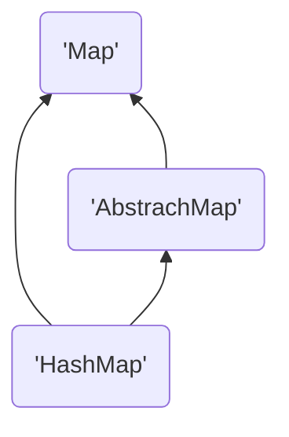

---
categories:
  - java-package-src
  - collections
---
# HashMap

*jdk 1.8*

[TOC]

## 包 java.util

## 继承关系



## 一些说明

### 1.8不会出现put导致死循环的情况了

### 引入了红黑树 优化了大量冲突时的性能

### 核心思想

1. 取hash *有特殊的hash方法*
2. 从数组中取到Entry的list/tree/item
3. 各种操作会 针对 第一个Entry就是符合的/树的特殊处理/遍历寻找 来进行

## 源码注解

```java
package java.util;

import java.io.IOException;
import java.io.InvalidObjectException;
import java.io.Serializable;
import java.lang.reflect.ParameterizedType;
import java.lang.reflect.Type;
import java.util.function.BiConsumer;
import java.util.function.BiFunction;
import java.util.function.Consumer;
import java.util.function.Function;
import sun.misc.SharedSecrets;

public class HashMap<K,V> extends AbstractMap<K,V>
    implements Map<K,V>, Cloneable, Serializable {

    private static final long serialVersionUID = 362498820763181265L;

    /*
     * Implementation notes.
     *
     * HashMap是一个分桶的Map，通常桶中的元素用list实现，但如果个数过多，会换成红黑树的实现
     * each structured similarly to those in
     * java.util.TreeMap. Most methods try to use normal bins, but
     * relay to TreeNode methods when applicable (simply by checking
     * instanceof a node).  Bins of TreeNodes may be traversed and
     * used like any others, but additionally support faster lookup
     * when overpopulated. However, since the vast majority of bins in
     * normal use are not overpopulated, checking for existence of
     * tree bins may be delayed in the course of table methods.
     *
     * Tree bins (i.e., bins whose elements are all TreeNodes) are
     * ordered primarily by hashCode, but in the case of ties, if two
     * elements are of the same "class C implements Comparable<C>",
     * type then their compareTo method is used for ordering. (We
     * conservatively check generic types via reflection to validate
     * this -- see method comparableClassFor).  The added complexity
     * of tree bins is worthwhile in providing worst-case O(log n)
     * operations when keys either have distinct hashes or are
     * orderable, Thus, performance degrades gracefully under
     * accidental or malicious usages in which hashCode() methods
     * return values that are poorly distributed, as well as those in
     * which many keys share a hashCode, so long as they are also
     * Comparable. (If neither of these apply, we may waste about a
     * factor of two in time and space compared to taking no
     * precautions. But the only known cases stem from poor user
     * programming practices that are already so slow that this makes
     * little difference.)
     *
     * 因为树节点的大小为普通节点的两倍，我们只在必要的时候使用
     * 当每个桶中的元素足够小的时候，就会转化为普通节点  In
     * usages with well-distributed user hashCodes, tree bins are
     * rarely used.  Ideally, under random hashCodes, the frequency of
     * nodes in bins follows a Poisson distribution
     * (http://en.wikipedia.org/wiki/Poisson_distribution) with a
     * parameter of about 0.5 on average for the default resizing
     * threshold of 0.75, although with a large variance because of
     * resizing granularity. Ignoring variance, the expected
     * occurrences of list size k are (exp(-0.5) * pow(0.5, k) /
     * factorial(k)). The first values are:
     *
     * 0:    0.60653066
     * 1:    0.30326533
     * 2:    0.07581633
     * 3:    0.01263606
     * 4:    0.00157952
     * 5:    0.00015795
     * 6:    0.00001316
     * 7:    0.00000094
     * 8:    0.00000006
     * more: less than 1 in ten million
     *
     * The root of a tree bin is normally its first node.  However,
     * sometimes (currently only upon Iterator.remove), the root might
     * be elsewhere, but can be recovered following parent links
     * (method TreeNode.root()).
     *
     * All applicable internal methods accept a hash code as an
     * argument (as normally supplied from a public method), allowing
     * them to call each other without recomputing user hashCodes.
     * Most internal methods also accept a "tab" argument, that is
     * normally the current table, but may be a new or old one when
     * resizing or converting.
     *
     * When bin lists are treeified, split, or untreeified, we keep
     * them in the same relative access/traversal order (i.e., field
     * Node.next) to better preserve locality, and to slightly
     * simplify handling of splits and traversals that invoke
     * iterator.remove. When using comparators on insertion, to keep a
     * total ordering (or as close as is required here) across
     * rebalancings, we compare classes and identityHashCodes as
     * tie-breakers.
     *
     * The use and transitions among plain vs tree modes is
     * complicated by the existence of subclass LinkedHashMap. See
     * below for hook methods defined to be invoked upon insertion,
     * removal and access that allow LinkedHashMap internals to
     * otherwise remain independent of these mechanics. (This also
     * requires that a map instance be passed to some utility methods
     * that may create new nodes.)
     *
     * The concurrent-programming-like SSA-based coding style helps
     * avoid aliasing errors amid all of the twisty pointer operations.
     */

    /**
     * 默认的容器大小 必须是2的指数
     */
    static final int DEFAULT_INITIAL_CAPACITY = 1 << 4; // 左移4位=16

    /**
     * 容器的最大大小 2^30 自定义也不能大于这个数值 必须是2的指数
     */
    static final int MAXIMUM_CAPACITY = 1 << 30;

    /**
     * 默认的负载因子
     */
    static final float DEFAULT_LOAD_FACTOR = 0.75f;

    /**
     * 一个阈值
     * 用于判定一个bin是使用list还是树的实现，当插入至少等于这个数值的bin时，将会转换成树
     * 这个值必须要大于2 并且 至少是8来保证在树收缩时，满足从树转化回list的假设？
     */
    static final int TREEIFY_THRESHOLD = 8;

    /**
     * 一个阈值，用于判定是否要将树转化为list
     * 需要小于TREEIFY_THRESHOLD，并且不大于6来满足收缩时的mesh？
     */
    static final int UNTREEIFY_THRESHOLD = 6;

    /**
     * bin转化为树的HashTable的最小容量
     * 否则会进行resize操作
     * 需要至少 4 * TREEIFY_THRESHOLD 来避免resize和treeify之间的冲突
     */
    static final int MIN_TREEIFY_CAPACITY = 64;

    /**
     * 基本的bin实现  (See below for
     * TreeNode subclass, and in LinkedHashMap for its Entry subclass.)
     */
    static class Node<K,V> implements Map.Entry<K,V> {
        final int hash;
        final K key;
        V value;
        Node<K,V> next;

        Node(int hash, K key, V value, Node<K,V> next) {
            this.hash = hash;
            this.key = key;
            this.value = value;
            this.next = next;
        }

        public final K getKey()        { return key; }
        public final V getValue()      { return value; }
        public final String toString() { return key + "=" + value; }

		// Q2A 为什么需要 k 和 v 的hash进行XOR运算？
        public final int hashCode() {
            return Objects.hashCode(key) ^ Objects.hashCode(value);
        }

        public final V setValue(V newValue) {
            V oldValue = value;
            value = newValue;
            return oldValue;
        }
		// 只有K V都相同时 才返回true
        public final boolean equals(Object o) {
            if (o == this)
                return true;
            if (o instanceof Map.Entry) {
                Map.Entry<?,?> e = (Map.Entry<?,?>)o;
                if (Objects.equals(key, e.getKey()) &&
                    Objects.equals(value, e.getValue()))
                    return true;
            }
            return false;
        }
    }

    /* ---------------- Static utilities -------------- */

    /**
     * 默认的hash算法 对key的hashCode返回值的高十六位和低十六位进行XOR
     * 因为容器使用了2的指数作为取下标的mask, 对于那些只在高于当前mask位数
     * 上进行变换的对象，很容易造成冲突，所以进行了这个操作，将高位的变化结合进来
     * 综合来看 仅仅进行一次xor操作并不会造成太多的性能负担
     */
    static final int hash(Object key) {
        int h;
        return (key == null) ? 0 : (h = key.hashCode()) ^ (h >>> 16);
    }

    /**
     * Returns x's Class if it is of the form "class C implements
     * Comparable<C>", else null.
     */
    static Class<?> comparableClassFor(Object x) {
        if (x instanceof Comparable) {
            Class<?> c; Type[] ts, as; Type t; ParameterizedType p;
            if ((c = x.getClass()) == String.class) // bypass checks
                return c;
            if ((ts = c.getGenericInterfaces()) != null) {
                for (int i = 0; i < ts.length; ++i) {
                    if (((t = ts[i]) instanceof ParameterizedType) &&
                        ((p = (ParameterizedType)t).getRawType() ==
                         Comparable.class) &&
                        (as = p.getActualTypeArguments()) != null &&
                        as.length == 1 && as[0] == c) // type arg is c
                        return c;
                }
            }
        }
        return null;
    }

    /**
     * Returns k.compareTo(x) if x matches kc (k's screened comparable
     * class), else 0.
     */
    @SuppressWarnings({"rawtypes","unchecked"}) // for cast to Comparable
    static int compareComparables(Class<?> kc, Object k, Object x) {
        return (x == null || x.getClass() != kc ? 0 :
                ((Comparable)k).compareTo(x));
    }

    /**
     * Returns a power of two size for the given target capacity.
     */
    static final int tableSizeFor(int cap) {
        int n = cap - 1;
        n |= n >>> 1;
        n |= n >>> 2;
        n |= n >>> 4;
        n |= n >>> 8;
        n |= n >>> 16;
        return (n < 0) ? 1 : (n >= MAXIMUM_CAPACITY) ? MAXIMUM_CAPACITY : n + 1;
    }

    /* ---------------- Fields -------------- */

    /**
     * 容器的底层实现，长度为2的指数倍的数组。在第一次被使用的时候初始化，必要的时候resize
     */
    transient Node<K,V>[] table;

    /**
     * Holds cached entrySet(). Note that AbstractMap fields are used
     * for keySet() and values().
     */
    transient Set<Map.Entry<K,V>> entrySet;

    /**
     * k-v对个数
     */
    transient int size;

    /**
     * 一个记录容器结构性改变的计数器，用于迭代器遍历时进行快速失败
     */
    transient int modCount;

    /**
     * 下一次进行resize的大小 (capacity * load factor).
     */
    int threshold;

    /**
     * 负载因子
     *
     * @serial
     */
    final float loadFactor;

    /* ---------------- Public operations -------------- */

    // 省略 一些初始化函数（负载因子/初始化大小/用其他map进行初始化）

    /**
     * 用于实现Map.putAll()接口 和 用其他map进行初始化 的构造函数
     */
    final void putMapEntries(Map<? extends K, ? extends V> m, boolean evict) {
        int s = m.size();
        if (s > 0) {
            if (table == null) { // 第一次初始化
                float ft = ((float)s / loadFactor) + 1.0F;
                int t = ((ft < (float)MAXIMUM_CAPACITY) ?
                         (int)ft : MAXIMUM_CAPACITY);
                if (t > threshold)
                    threshold = tableSizeFor(t);
            }
            else if (s > threshold) // 如果要插入大于阈值的entry 立即进行resize
                resize();
            for (Map.Entry<? extends K, ? extends V> e : m.entrySet()) {
                K key = e.getKey();
                V value = e.getValue();
                putVal(hash(key), key, value, false, evict);
            }
        }
    }

    /**
     * 返回size
     */
    public int size() {
        return size;
    }

    /**
     * 是否为空
     */
    public boolean isEmpty() {
        return size == 0;
    }

    /**
     * 根据K返回V
     */
    public V get(Object key) {
        Node<K,V> e;
        return (e = getNode(hash(key), key)) == null ? null : e.value;
    }

    /**
     * 基础函数
     */
    final Node<K,V> getNode(int hash, Object key) {
        Node<K,V>[] tab; Node<K,V> first, e; int n; K k;
        if ((tab = table) != null && (n = tab.length) > 0 &&
            (first = tab[(n - 1) & hash]) != null) { // 初始化过，有entry，对应的下标有东西
            if (first.hash == hash && // 检查第一个节点
                ((k = first.key) == key || (key != null && key.equals(k))))
                // 直接比较指针 或者 equals都可以
                return first;
            if ((e = first.next) != null) {
                if (first instanceof TreeNode) // 比较树节点
                    return ((TreeNode<K,V>)first).getTreeNode(hash, key);
                do {
                    if (e.hash == hash &&
                        ((k = e.key) == key || (key != null && key.equals(k))))
                        // 直接比较指针 或者 equals都可以
                        return e;
                } while ((e = e.next) != null);
            }
        }
        return null;
    }

    public boolean containsKey(Object key) {
        return getNode(hash(key), key) != null;
    }

    /**
     * 新建一个映射关系 并 打破原有的映射关系 如果有的话
     */
    public V put(K key, V value) {
        return putVal(hash(key), key, value, false, true);
    }

    /**
     * 基础函数
     */
    final V putVal(int hash, K key, V value, boolean onlyIfAbsent,
                   boolean evict) {
        Node<K,V>[] tab; Node<K,V> p; int n, i;
        if ((tab = table) == null || (n = tab.length) == 0)
            n = (tab = resize()).length; // 懒加载
        if ((p = tab[i = (n - 1) & hash]) == null) // 如果没有冲突 直接插入
            tab[i] = newNode(hash, key, value, null);
        else {
            Node<K,V> e; K k;
            if (p.hash == hash &&
                ((k = p.key) == key || (key != null && key.equals(k))))
                e = p; // 先处理首节点 如果key相同 == 或者 equals 就跳出等待插入
            else if (p instanceof TreeNode) // 树的put
                e = ((TreeNode<K,V>)p).putTreeVal(this, tab, hash, key, value);
            else { // 遍历
                for (int binCount = 0; ; ++binCount) {
                    if ((e = p.next) == null) { // 如果最后一个了 插入
                        p.next = newNode(hash, key, value, null);
                        if (binCount >= TREEIFY_THRESHOLD - 1) // -1 for 1st
                            treeifyBin(tab, hash); // 是否要进行treeify
                        break;
                    }
                    if (e.hash == hash &&
                        ((k = e.key) == key || (key != null && key.equals(k))))
                        break; // 如果key相同 跳出 然后插入
                    p = e;
                }
            }
            if (e != null) { // 插入
                V oldValue = e.value;
                if (!onlyIfAbsent || oldValue == null) // 判断是否是只在没有冲突的情况下插入
                    e.value = value;
                afterNodeAccess(e); // 用于兼容LinkedHashMap
                return oldValue;
            }
        }
        ++modCount; // 修改结构了
        if (++size > threshold)
            resize(); // 判断要不要进行resize
        afterNodeInsertion(evict); // 用于兼容LinkedHashMap
        return null;
    }

    /**
     * 初始化或者将容量加倍
     */
    final Node<K,V>[] resize() {
        Node<K,V>[] oldTab = table;
        int oldCap = (oldTab == null) ? 0 : oldTab.length;
        int oldThr = threshold;
        int newCap, newThr = 0;
        if (oldCap > 0) {
            if (oldCap >= MAXIMUM_CAPACITY) { // 无法扩容了
                threshold = Integer.MAX_VALUE;
                return oldTab;
            }
            else if ((newCap = oldCap << 1) < MAXIMUM_CAPACITY &&
                     oldCap >= DEFAULT_INITIAL_CAPACITY)
                newThr = oldThr << 1; // 如果可以扩容 就将threshold加倍
        }
        else if (oldThr > 0) // 根据threshhold初始化
            newCap = oldThr;
        else {               // 完全没有初始化过 使用默认值
            newCap = DEFAULT_INITIAL_CAPACITY;
            newThr = (int)(DEFAULT_LOAD_FACTOR * DEFAULT_INITIAL_CAPACITY);
        }
        if (newThr == 0) {
            float ft = (float)newCap * loadFactor; // 计算特殊情况下的新threshold
            newThr = (newCap < MAXIMUM_CAPACITY && ft < (float)MAXIMUM_CAPACITY ?
                      (int)ft : Integer.MAX_VALUE);
        }
        threshold = newThr;
        @SuppressWarnings({"rawtypes","unchecked"})
            Node<K,V>[] newTab = (Node<K,V>[])new Node[newCap];
        table = newTab;
        if (oldTab != null) { // 将entry迁移到新的table里面
            for (int j = 0; j < oldCap; ++j) {
                Node<K,V> e;
                if ((e = oldTab[j]) != null) {
                    oldTab[j] = null; // 帮助gc
                    if (e.next == null) // 如果只有一个
                        newTab[e.hash & (newCap - 1)] = e;
                    else if (e instanceof TreeNode) // 如果treeify之后的bin，走特殊的方法
                        ((TreeNode<K,V>)e).split(this, newTab, j, oldCap);
                    else { // 有多个的时候
                        Node<K,V> loHead = null, loTail = null; // resize之后 位于原idx
                        Node<K,V> hiHead = null, hiTail = null; // 位于 原idx+oldCap
                        Node<K,V> next;
                        do {
                            next = e.next;
                            if ((e.hash & oldCap) == 0) { // 放到原idx上的
                                if (loTail == null)
                                    loHead = e;
                                else
                                    loTail.next = e;
                                loTail = e;
                            }
                            else { // 放到 原idx+oldCap
                                if (hiTail == null)
                                    hiHead = e;
                                else
                                    hiTail.next = e;
                                hiTail = e;
                            }
                        } while ((e = next) != null);
                        if (loTail != null) {
                            loTail.next = null;
                            newTab[j] = loHead; // 写到新table中
                        }
                        if (hiTail != null) {
                            hiTail.next = null;
                            newTab[j + oldCap] = hiHead; // 写到新table中
                        }
                    }
                }
            }
        }
        return newTab;
    }

    /**
     * 进行treeify
     */
    final void treeifyBin(Node<K,V>[] tab, int hash) {
        int n, index; Node<K,V> e;
        if (tab == null || (n = tab.length) < MIN_TREEIFY_CAPACITY)
            resize(); // 如果没有满足最小树化的容器大小 进行resize
        else if ((e = tab[index = (n - 1) & hash]) != null) {
            TreeNode<K,V> hd = null, tl = null; // 先构造了一个链表
            do {
                TreeNode<K,V> p = replacementTreeNode(e, null); // 生成TreeNode
                if (tl == null) // 链接起来 构造一个双向链表 Q2A
                    hd = p;
                else {
                    p.prev = tl;
                    tl.next = p;
                }
                tl = p;
            } while ((e = e.next) != null);
            if ((tab[index] = hd) != null)
                hd.treeify(tab); // 转化成树
        }
    }

    public void putAll(Map<? extends K, ? extends V> m) {
        putMapEntries(m, true);
    }

    public V remove(Object key) {
        Node<K,V> e;
        return (e = removeNode(hash(key), key, null, false, true)) == null ?
            null : e.value;
    }

    /**
     * 基础函数
     */
    final Node<K,V> removeNode(int hash, Object key, Object value,
                               boolean matchValue, boolean movable) {
        Node<K,V>[] tab; Node<K,V> p; int n, index;
        if ((tab = table) != null && (n = tab.length) > 0 &&
            (p = tab[index = (n - 1) & hash]) != null) { // 有entry.hash == hash
            Node<K,V> node = null, e; K k; V v;
            if (p.hash == hash &&
                ((k = p.key) == key || (key != null && key.equals(k))))
                node = p; // 第一个就是
            else if ((e = p.next) != null) {
                if (p instanceof TreeNode) // treeify的查找树节点
                    node = ((TreeNode<K,V>)p).getTreeNode(hash, key);
                else {
                    do { // 查找list中的目标节点
                        if (e.hash == hash &&
                            ((k = e.key) == key ||
                             (key != null && key.equals(k)))) {
                            node = e;
                            break;
                        }
                        p = e;
                    } while ((e = e.next) != null);
                }
            }
            // 如果找到了目标节点
            if (node != null && (!matchValue || (v = node.value) == value ||
                                 (value != null && value.equals(v)))) { // 比较v如果需要
                if (node instanceof TreeNode) // treeify之后 特殊方法
                    ((TreeNode<K,V>)node).removeTreeNode(this, tab, movable);
                else if (node == p) // 第一个的话直接替换
                    tab[index] = node.next;
                else
                    p.next = node.next; // 中间 前节点链接到后节点
                ++modCount; // 修改了结构
                --size;
                afterNodeRemoval(node); // 兼容LinkedHashMap
                return node;
            }
        }
        return null;
    }

    /**
     * 清空
     */
    public void clear() {
        Node<K,V>[] tab;
        modCount++; // 进行了结构性的变化
        if ((tab = table) != null && size > 0) {
            size = 0;
            for (int i = 0; i < tab.length; ++i)
                tab[i] = null;
        }
    }

    public boolean containsValue(Object value) {
        Node<K,V>[] tab; V v;
        if ((tab = table) != null && size > 0) {
            for (int i = 0; i < tab.length; ++i) {
                for (Node<K,V> e = tab[i]; e != null; e = e.next) {
                    if ((v = e.value) == value ||
                        (value != null && value.equals(v)))
                        return true;
                }
            }
        }
        return false;
    }

    /**
     * 返回一个包含全部key值的set，er1c注：类似于关系数据库中的视图这个概念
     * 这个set是map的一个浅拷贝，所以说修改map或者set中的值，都会影响到另一方
     * 如果在用迭代器遍历set时，修改了map，结果是未定义的 除非是通过迭代器自己的remove方法 Q2A
     * set支持remove操作。通过Iterator.remove,Set.remove,removeAll,retainAll,clear
     * 这些方法都会一致性的反映到map中
     * 不支持add操作
     */
    public Set<K> keySet() {
        Set<K> ks = keySet;
        if (ks == null) {
            ks = new KeySet();
            keySet = ks;
        }
        return ks;
    }

    final class KeySet extends AbstractSet<K> { // 定义KeySet
        public final int size()                 { return size; } // 调用map的方法
        public final void clear()               { HashMap.this.clear(); }// 调用map的方法
        public final Iterator<K> iterator()     { return new KeyIterator(); }
        public final boolean contains(Object o) { return containsKey(o); }//调用map的方法
        public final boolean remove(Object key) {
            return removeNode(hash(key), key, null, false, true) != null;
        } // 调用map的方法
        public final Spliterator<K> spliterator() {
            return new KeySpliterator<>(HashMap.this, 0, -1, 0, 0); // 并发分割
        }
        public final void forEach(Consumer<? super K> action) { // Q2A
            Node<K,V>[] tab;
            if (action == null)
                throw new NullPointerException();
            if (size > 0 && (tab = table) != null) {
                int mc = modCount;
                for (int i = 0; i < tab.length; ++i) {
                    for (Node<K,V> e = tab[i]; e != null; e = e.next)
                        action.accept(e.key);
                }
                if (modCount != mc)
                    throw new ConcurrentModificationException();
            }
        }
    }

    /**
     * 与KeySet完全一致的性质 类似与关系数据库的view
     */
    public Collection<V> values() {
        Collection<V> vs = values;
        if (vs == null) {
            vs = new Values();
            values = vs;
        }
        return vs;
    }

    final class Values extends AbstractCollection<V> { // 部分方法使用了map的方法
        public final int size()                 { return size; }
        public final void clear()               { HashMap.this.clear(); }
        public final Iterator<V> iterator()     { return new ValueIterator(); }
        public final boolean contains(Object o) { return containsValue(o); }
        public final Spliterator<V> spliterator() {
            return new ValueSpliterator<>(HashMap.this, 0, -1, 0, 0);
        }
        public final void forEach(Consumer<? super V> action) {
            Node<K,V>[] tab;
            if (action == null)
                throw new NullPointerException();
            if (size > 0 && (tab = table) != null) {
                int mc = modCount;
                for (int i = 0; i < tab.length; ++i) {
                    for (Node<K,V> e = tab[i]; e != null; e = e.next)
                        action.accept(e.value);
                }
                if (modCount != mc)
                    throw new ConcurrentModificationException();
            }
        }
    }

    /**
     * 返回一个EntrySet的视图 类似于上面两个
     */
    public Set<Map.Entry<K,V>> entrySet() {
        Set<Map.Entry<K,V>> es;
        return (es = entrySet) == null ? (entrySet = new EntrySet()) : es;
    }

    // 部分方法使用map方法实现
    final class EntrySet extends AbstractSet<Map.Entry<K,V>> {
        public final int size()                 { return size; }
        public final void clear()               { HashMap.this.clear(); }
        public final Iterator<Map.Entry<K,V>> iterator() {
            return new EntryIterator();
        }
        public final boolean contains(Object o) { // 先找key
            if (!(o instanceof Map.Entry))
                return false;
            Map.Entry<?,?> e = (Map.Entry<?,?>) o;
            Object key = e.getKey();
            Node<K,V> candidate = getNode(hash(key), key);
            return candidate != null && candidate.equals(e); // 再判断value
        }
        public final boolean remove(Object o) {
            if (o instanceof Map.Entry) {
                Map.Entry<?,?> e = (Map.Entry<?,?>) o;
                Object key = e.getKey();
                Object value = e.getValue();
                return removeNode(hash(key), key, value, true, true) != null;
            }
            return false;
        }
        public final Spliterator<Map.Entry<K,V>> spliterator() { // 并发 分割
            return new EntrySpliterator<>(HashMap.this, 0, -1, 0, 0);
        }
        public final void forEach(Consumer<? super Map.Entry<K,V>> action) {
            Node<K,V>[] tab;
            if (action == null)
                throw new NullPointerException();
            if (size > 0 && (tab = table) != null) {
                int mc = modCount;
                for (int i = 0; i < tab.length; ++i) {
                    for (Node<K,V> e = tab[i]; e != null; e = e.next)
                        action.accept(e);
                }
                if (modCount != mc)
                    throw new ConcurrentModificationException();
            }
        }
    }

    // Overrides of JDK8 Map extension methods

    @Override
    public V getOrDefault(Object key, V defaultValue) {
        Node<K,V> e;
        return (e = getNode(hash(key), key)) == null ? defaultValue : e.value;
    }

    @Override
    public V putIfAbsent(K key, V value) {
        return putVal(hash(key), key, value, true, true);
    }

    @Override
    public boolean remove(Object key, Object value) {
        return removeNode(hash(key), key, value, true, true) != null;
    }

    @Override
    public boolean replace(K key, V oldValue, V newValue) { // 类似cas
        Node<K,V> e; V v;
        if ((e = getNode(hash(key), key)) != null &&
            ((v = e.value) == oldValue || (v != null && v.equals(oldValue)))) {
            e.value = newValue;
            afterNodeAccess(e);
            return true;
        }
        return false;
    }

    @Override
    public V replace(K key, V value) { // 返回被替换的value
        Node<K,V> e;
        if ((e = getNode(hash(key), key)) != null) {
            V oldValue = e.value;
            e.value = value;
            afterNodeAccess(e);
            return oldValue;
        }
        return null;
    }

    @Override // 如果存在key 按照mappingFunction重新安排位置
    public V computeIfAbsent(K key,
                             Function<? super K, ? extends V> mappingFunction) {
        if (mappingFunction == null)
            throw new NullPointerException();
        int hash = hash(key);
        Node<K,V>[] tab; Node<K,V> first; int n, i;
        int binCount = 0;
        TreeNode<K,V> t = null;
        Node<K,V> old = null;
        if (size > threshold || (tab = table) == null ||
            (n = tab.length) == 0)
            n = (tab = resize()).length;
        if ((first = tab[i = (n - 1) & hash]) != null) {
            if (first instanceof TreeNode)
                old = (t = (TreeNode<K,V>)first).getTreeNode(hash, key);
            else {
                Node<K,V> e = first; K k;
                do {
                    if (e.hash == hash &&
                        ((k = e.key) == key || (key != null && key.equals(k)))) {
                        old = e;
                        break;
                    }
                    ++binCount;
                } while ((e = e.next) != null);
            }
            V oldValue;
            if (old != null && (oldValue = old.value) != null) {
                afterNodeAccess(old);
                return oldValue;
            }
        }
        V v = mappingFunction.apply(key);
        if (v == null) {
            return null;
        } else if (old != null) {
            old.value = v;
            afterNodeAccess(old);
            return v;
        }
        else if (t != null)
            t.putTreeVal(this, tab, hash, key, v);
        else {
            tab[i] = newNode(hash, key, v, first);
            if (binCount >= TREEIFY_THRESHOLD - 1)
                treeifyBin(tab, hash);
        }
        ++modCount;
        ++size;
        afterNodeInsertion(true);
        return v;
    }

    public V computeIfPresent(K key,
                              BiFunction<? super K, ? super V, ? extends V> remappingFunction) {
        if (remappingFunction == null)
            throw new NullPointerException();
        Node<K,V> e; V oldValue;
        int hash = hash(key);
        if ((e = getNode(hash, key)) != null &&
            (oldValue = e.value) != null) {
            V v = remappingFunction.apply(key, oldValue);
            if (v != null) {
                e.value = v;
                afterNodeAccess(e);
                return v;
            }
            else
                removeNode(hash, key, null, false, true);
        }
        return null;
    }

    @Override // 对K执行 remappingFunction
    public V compute(K key,
                     BiFunction<? super K, ? super V, ? extends V> remappingFunction) {
        if (remappingFunction == null)
            throw new NullPointerException();
        int hash = hash(key);
        Node<K,V>[] tab; Node<K,V> first; int n, i;
        int binCount = 0;
        TreeNode<K,V> t = null;
        Node<K,V> old = null;
        if (size > threshold || (tab = table) == null ||
            (n = tab.length) == 0)
            n = (tab = resize()).length;
        if ((first = tab[i = (n - 1) & hash]) != null) {
            if (first instanceof TreeNode)
                old = (t = (TreeNode<K,V>)first).getTreeNode(hash, key);
            else {
                Node<K,V> e = first; K k;
                do {
                    if (e.hash == hash &&
                        ((k = e.key) == key || (key != null && key.equals(k)))) {
                        old = e;
                        break;
                    }
                    ++binCount;
                } while ((e = e.next) != null);
            }
        }
        V oldValue = (old == null) ? null : old.value;
        V v = remappingFunction.apply(key, oldValue);
        if (old != null) {
            if (v != null) {
                old.value = v;
                afterNodeAccess(old);
            }
            else
                removeNode(hash, key, null, false, true);
        }
        else if (v != null) {
            if (t != null)
                t.putTreeVal(this, tab, hash, key, v);
            else {
                tab[i] = newNode(hash, key, v, first);
                if (binCount >= TREEIFY_THRESHOLD - 1)
                    treeifyBin(tab, hash);
            }
            ++modCount;
            ++size;
            afterNodeInsertion(true);
        }
        return v;
    }

    @Override
    public V merge(K key, V value,
                   BiFunction<? super V, ? super V, ? extends V> remappingFunction) {
        if (value == null)
            throw new NullPointerException();
        if (remappingFunction == null)
            throw new NullPointerException();
        int hash = hash(key);
        Node<K,V>[] tab; Node<K,V> first; int n, i;
        int binCount = 0;
        TreeNode<K,V> t = null;
        Node<K,V> old = null;
        if (size > threshold || (tab = table) == null ||
            (n = tab.length) == 0)
            n = (tab = resize()).length;
        if ((first = tab[i = (n - 1) & hash]) != null) {
            if (first instanceof TreeNode)
                old = (t = (TreeNode<K,V>)first).getTreeNode(hash, key);
            else {
                Node<K,V> e = first; K k;
                do {
                    if (e.hash == hash &&
                        ((k = e.key) == key || (key != null && key.equals(k)))) {
                        old = e;
                        break;
                    }
                    ++binCount;
                } while ((e = e.next) != null);
            }
        }
        if (old != null) {
            V v;
            if (old.value != null)
                v = remappingFunction.apply(old.value, value);
            else
                v = value;
            if (v != null) {
                old.value = v;
                afterNodeAccess(old);
            }
            else
                removeNode(hash, key, null, false, true);
            return v;
        }
        if (value != null) {
            if (t != null)
                t.putTreeVal(this, tab, hash, key, value);
            else {
                tab[i] = newNode(hash, key, value, first);
                if (binCount >= TREEIFY_THRESHOLD - 1)
                    treeifyBin(tab, hash);
            }
            ++modCount;
            ++size;
            afterNodeInsertion(true);
        }
        return value;
    }

    @Override // 对没一个对象进行action
    public void forEach(BiConsumer<? super K, ? super V> action) {
        Node<K,V>[] tab;
        if (action == null)
            throw new NullPointerException();
        if (size > 0 && (tab = table) != null) {
            int mc = modCount;
            for (int i = 0; i < tab.length; ++i) {
                for (Node<K,V> e = tab[i]; e != null; e = e.next)
                    action.accept(e.key, e.value);
            }
            if (modCount != mc)
                throw new ConcurrentModificationException();
        }
    }

    @Override // 用function计算新v替换每一个v
    public void replaceAll(BiFunction<? super K, ? super V, ? extends V> function) {
        Node<K,V>[] tab;
        if (function == null)
            throw new NullPointerException();
        if (size > 0 && (tab = table) != null) {
            int mc = modCount;
            for (int i = 0; i < tab.length; ++i) {
                for (Node<K,V> e = tab[i]; e != null; e = e.next) {
                    e.value = function.apply(e.key, e.value);
                }
            }
            if (modCount != mc)
                throw new ConcurrentModificationException();
        }
    }

    /* ------------------------------------------------------------ */
    // Cloning and serialization

    /**
     * 浅拷贝
     */
    @SuppressWarnings("unchecked")
    @Override
    public Object clone() {
        HashMap<K,V> result;
        try {
            result = (HashMap<K,V>)super.clone();
        } catch (CloneNotSupportedException e) {
            // this shouldn't happen, since we are Cloneable
            throw new InternalError(e);
        }
        result.reinitialize();
        result.putMapEntries(this, false);
        return result;
    }

    // These methods are also used when serializing HashSets
    final float loadFactor() { return loadFactor; }
    final int capacity() {
        return (table != null) ? table.length :
            (threshold > 0) ? threshold :
            DEFAULT_INITIAL_CAPACITY;
    }

    /**
     * Save the state of the <tt>HashMap</tt> instance to a stream (i.e.,
     * serialize it).
     *
     * @serialData The <i>capacity</i> of the HashMap (the length of the
     *             bucket array) is emitted (int), followed by the
     *             <i>size</i> (an int, the number of key-value
     *             mappings), followed by the key (Object) and value (Object)
     *             for each key-value mapping.  The key-value mappings are
     *             emitted in no particular order.
     */
    private void writeObject(java.io.ObjectOutputStream s)
        throws IOException {
        int buckets = capacity();
        // Write out the threshold, loadfactor, and any hidden stuff
        s.defaultWriteObject();
        s.writeInt(buckets);
        s.writeInt(size);
        internalWriteEntries(s);
    }

    /**
     * Reconstitute the {@code HashMap} instance from a stream (i.e.,
     * deserialize it).
     */
    private void readObject(java.io.ObjectInputStream s)
        throws IOException, ClassNotFoundException {
        // Read in the threshold (ignored), loadfactor, and any hidden stuff
        s.defaultReadObject();
        reinitialize();
        if (loadFactor <= 0 || Float.isNaN(loadFactor))
            throw new InvalidObjectException("Illegal load factor: " +
                                             loadFactor);
        s.readInt();                // Read and ignore number of buckets
        int mappings = s.readInt(); // Read number of mappings (size)
        if (mappings < 0)
            throw new InvalidObjectException("Illegal mappings count: " +
                                             mappings);
        else if (mappings > 0) { // (if zero, use defaults)
            // Size the table using given load factor only if within
            // range of 0.25...4.0
            float lf = Math.min(Math.max(0.25f, loadFactor), 4.0f);
            float fc = (float)mappings / lf + 1.0f;
            int cap = ((fc < DEFAULT_INITIAL_CAPACITY) ?
                       DEFAULT_INITIAL_CAPACITY :
                       (fc >= MAXIMUM_CAPACITY) ?
                       MAXIMUM_CAPACITY :
                       tableSizeFor((int)fc));
            float ft = (float)cap * lf;
            threshold = ((cap < MAXIMUM_CAPACITY && ft < MAXIMUM_CAPACITY) ?
                         (int)ft : Integer.MAX_VALUE);

            // Check Map.Entry[].class since it's the nearest public type to
            // what we're actually creating.
            SharedSecrets.getJavaOISAccess().checkArray(s, Map.Entry[].class, cap);
            @SuppressWarnings({"rawtypes","unchecked"})
            Node<K,V>[] tab = (Node<K,V>[])new Node[cap];
            table = tab;

            // Read the keys and values, and put the mappings in the HashMap
            for (int i = 0; i < mappings; i++) {
                @SuppressWarnings("unchecked")
                    K key = (K) s.readObject();
                @SuppressWarnings("unchecked")
                    V value = (V) s.readObject();
                putVal(hash(key), key, value, false, false);
            }
        }
    }

    /* ------------------------------------------------------------ */
    // iterators

    abstract class HashIterator {
        Node<K,V> next;        // next entry to return
        Node<K,V> current;     // current entry
        int expectedModCount;  // for fast-fail
        int index;             // current slot

        HashIterator() {
            expectedModCount = modCount;
            Node<K,V>[] t = table;
            current = next = null;
            index = 0;
            if (t != null && size > 0) { // 初始化执行第一个Entry
                do {} while (index < t.length && (next = t[index++]) == null);
            }
        }

        public final boolean hasNext() {
            return next != null;
        }

        final Node<K,V> nextNode() {
            Node<K,V>[] t;
            Node<K,V> e = next;
            if (modCount != expectedModCount) // 判断是否在遍历的时候修改过
                throw new ConcurrentModificationException();
            if (e == null)
                throw new NoSuchElementException();
            if ((next = (current = e).next) == null && (t = table) != null) {
                do {} while (index < t.length && (next = t[index++]) == null);
            }
            return e;
        }

        public final void remove() { // 移除Entry
            Node<K,V> p = current;
            if (p == null)
                throw new IllegalStateException();
            if (modCount != expectedModCount)
                throw new ConcurrentModificationException();
            current = null;
            K key = p.key;
            removeNode(hash(key), key, null, false, false);
            expectedModCount = modCount;
        }
    }

    final class KeyIterator extends HashIterator
        implements Iterator<K> {
        public final K next() { return nextNode().key; }
    }

    final class ValueIterator extends HashIterator
        implements Iterator<V> {
        public final V next() { return nextNode().value; }
    }

    final class EntryIterator extends HashIterator
        implements Iterator<Map.Entry<K,V>> {
        public final Map.Entry<K,V> next() { return nextNode(); }
    }

    /* ------------------------------------------------------------ */
    // spliterators Q2A 并发分割器

    static class HashMapSpliterator<K,V> {
        final HashMap<K,V> map;
        Node<K,V> current;          // current node
        int index;                  // current index, modified on advance/split
        int fence;                  // one past last index
        int est;                    // size estimate
        int expectedModCount;       // for comodification checks

        HashMapSpliterator(HashMap<K,V> m, int origin,
                           int fence, int est,
                           int expectedModCount) {
            this.map = m;
            this.index = origin;
            this.fence = fence;
            this.est = est;
            this.expectedModCount = expectedModCount;
        }

        final int getFence() { // initialize fence and size on first use
            int hi;
            if ((hi = fence) < 0) {
                HashMap<K,V> m = map;
                est = m.size;
                expectedModCount = m.modCount;
                Node<K,V>[] tab = m.table;
                hi = fence = (tab == null) ? 0 : tab.length;
            }
            return hi;
        }

        public final long estimateSize() {
            getFence(); // force init
            return (long) est;
        }
    }

    static final class KeySpliterator<K,V>
        extends HashMapSpliterator<K,V>
        implements Spliterator<K> {
        KeySpliterator(HashMap<K,V> m, int origin, int fence, int est,
                       int expectedModCount) {
            super(m, origin, fence, est, expectedModCount);
        }

        public KeySpliterator<K,V> trySplit() {
            int hi = getFence(), lo = index, mid = (lo + hi) >>> 1;
            return (lo >= mid || current != null) ? null :
                new KeySpliterator<>(map, lo, index = mid, est >>>= 1,
                                        expectedModCount);
        }

        public void forEachRemaining(Consumer<? super K> action) {
            int i, hi, mc;
            if (action == null)
                throw new NullPointerException();
            HashMap<K,V> m = map;
            Node<K,V>[] tab = m.table;
            if ((hi = fence) < 0) {
                mc = expectedModCount = m.modCount;
                hi = fence = (tab == null) ? 0 : tab.length;
            }
            else
                mc = expectedModCount;
            if (tab != null && tab.length >= hi &&
                (i = index) >= 0 && (i < (index = hi) || current != null)) {
                Node<K,V> p = current;
                current = null;
                do {
                    if (p == null)
                        p = tab[i++];
                    else {
                        action.accept(p.key);
                        p = p.next;
                    }
                } while (p != null || i < hi);
                if (m.modCount != mc)
                    throw new ConcurrentModificationException();
            }
        }

        public boolean tryAdvance(Consumer<? super K> action) {
            int hi;
            if (action == null)
                throw new NullPointerException();
            Node<K,V>[] tab = map.table;
            if (tab != null && tab.length >= (hi = getFence()) && index >= 0) {
                while (current != null || index < hi) {
                    if (current == null)
                        current = tab[index++];
                    else {
                        K k = current.key;
                        current = current.next;
                        action.accept(k);
                        if (map.modCount != expectedModCount)
                            throw new ConcurrentModificationException();
                        return true;
                    }
                }
            }
            return false;
        }

        public int characteristics() {
            return (fence < 0 || est == map.size ? Spliterator.SIZED : 0) |
                Spliterator.DISTINCT;
        }
    }

    static final class ValueSpliterator<K,V>
        extends HashMapSpliterator<K,V>
        implements Spliterator<V> {
        ValueSpliterator(HashMap<K,V> m, int origin, int fence, int est,
                         int expectedModCount) {
            super(m, origin, fence, est, expectedModCount);
        }

        public ValueSpliterator<K,V> trySplit() {
            int hi = getFence(), lo = index, mid = (lo + hi) >>> 1;
            return (lo >= mid || current != null) ? null :
                new ValueSpliterator<>(map, lo, index = mid, est >>>= 1,
                                          expectedModCount);
        }

        public void forEachRemaining(Consumer<? super V> action) {
            int i, hi, mc;
            if (action == null)
                throw new NullPointerException();
            HashMap<K,V> m = map;
            Node<K,V>[] tab = m.table;
            if ((hi = fence) < 0) {
                mc = expectedModCount = m.modCount;
                hi = fence = (tab == null) ? 0 : tab.length;
            }
            else
                mc = expectedModCount;
            if (tab != null && tab.length >= hi &&
                (i = index) >= 0 && (i < (index = hi) || current != null)) {
                Node<K,V> p = current;
                current = null;
                do {
                    if (p == null)
                        p = tab[i++];
                    else {
                        action.accept(p.value);
                        p = p.next;
                    }
                } while (p != null || i < hi);
                if (m.modCount != mc)
                    throw new ConcurrentModificationException();
            }
        }

        public boolean tryAdvance(Consumer<? super V> action) {
            int hi;
            if (action == null)
                throw new NullPointerException();
            Node<K,V>[] tab = map.table;
            if (tab != null && tab.length >= (hi = getFence()) && index >= 0) {
                while (current != null || index < hi) {
                    if (current == null)
                        current = tab[index++];
                    else {
                        V v = current.value;
                        current = current.next;
                        action.accept(v);
                        if (map.modCount != expectedModCount)
                            throw new ConcurrentModificationException();
                        return true;
                    }
                }
            }
            return false;
        }

        public int characteristics() {
            return (fence < 0 || est == map.size ? Spliterator.SIZED : 0);
        }
    }

    static final class EntrySpliterator<K,V>
        extends HashMapSpliterator<K,V>
        implements Spliterator<Map.Entry<K,V>> {
        EntrySpliterator(HashMap<K,V> m, int origin, int fence, int est,
                         int expectedModCount) {
            super(m, origin, fence, est, expectedModCount);
        }

        public EntrySpliterator<K,V> trySplit() {
            int hi = getFence(), lo = index, mid = (lo + hi) >>> 1;
            return (lo >= mid || current != null) ? null :
                new EntrySpliterator<>(map, lo, index = mid, est >>>= 1,
                                          expectedModCount);
        }

        public void forEachRemaining(Consumer<? super Map.Entry<K,V>> action) {
            int i, hi, mc;
            if (action == null)
                throw new NullPointerException();
            HashMap<K,V> m = map;
            Node<K,V>[] tab = m.table;
            if ((hi = fence) < 0) {
                mc = expectedModCount = m.modCount;
                hi = fence = (tab == null) ? 0 : tab.length;
            }
            else
                mc = expectedModCount;
            if (tab != null && tab.length >= hi &&
                (i = index) >= 0 && (i < (index = hi) || current != null)) {
                Node<K,V> p = current;
                current = null;
                do {
                    if (p == null)
                        p = tab[i++];
                    else {
                        action.accept(p);
                        p = p.next;
                    }
                } while (p != null || i < hi);
                if (m.modCount != mc)
                    throw new ConcurrentModificationException();
            }
        }

        public boolean tryAdvance(Consumer<? super Map.Entry<K,V>> action) {
            int hi;
            if (action == null)
                throw new NullPointerException();
            Node<K,V>[] tab = map.table;
            if (tab != null && tab.length >= (hi = getFence()) && index >= 0) {
                while (current != null || index < hi) {
                    if (current == null)
                        current = tab[index++];
                    else {
                        Node<K,V> e = current;
                        current = current.next;
                        action.accept(e);
                        if (map.modCount != expectedModCount)
                            throw new ConcurrentModificationException();
                        return true;
                    }
                }
            }
            return false;
        }

        public int characteristics() {
            return (fence < 0 || est == map.size ? Spliterator.SIZED : 0) |
                Spliterator.DISTINCT;
        }
    }

    /* ------------------------------------------------------------ */
    // LinkedHashMap support 


    /*
     * 只用于LinkedHashMap来重写这些方法
     */

    // Create a regular (non-tree) node
    Node<K,V> newNode(int hash, K key, V value, Node<K,V> next) {
        return new Node<>(hash, key, value, next);
    }

    // For conversion from TreeNodes to plain nodes
    Node<K,V> replacementNode(Node<K,V> p, Node<K,V> next) {
        return new Node<>(p.hash, p.key, p.value, next);
    }

    // Create a tree bin node
    TreeNode<K,V> newTreeNode(int hash, K key, V value, Node<K,V> next) {
        return new TreeNode<>(hash, key, value, next);
    }

    // For treeifyBin
    TreeNode<K,V> replacementTreeNode(Node<K,V> p, Node<K,V> next) {
        return new TreeNode<>(p.hash, p.key, p.value, next);
    }

    /**
     * Reset to initial default state.  Called by clone and readObject.
     */
    void reinitialize() {
        table = null;
        entrySet = null;
        keySet = null;
        values = null;
        modCount = 0;
        threshold = 0;
        size = 0;
    }

    // Callbacks to allow LinkedHashMap post-actions
    void afterNodeAccess(Node<K,V> p) { }
    void afterNodeInsertion(boolean evict) { }
    void afterNodeRemoval(Node<K,V> p) { }

    // Called only from writeObject, to ensure compatible ordering.
    void internalWriteEntries(java.io.ObjectOutputStream s) throws IOException {
        Node<K,V>[] tab;
        if (size > 0 && (tab = table) != null) {
            for (int i = 0; i < tab.length; ++i) {
                for (Node<K,V> e = tab[i]; e != null; e = e.next) {
                    s.writeObject(e.key);
                    s.writeObject(e.value);
                }
            }
        }
    }

    /* ------------------------------------------------------------ */
    // Tree bins

    /**
     * 既能作为树节点，又能作为链表节点
     */
    static final class TreeNode<K,V> extends LinkedHashMap.Entry<K,V> {
        TreeNode<K,V> parent;  // 红黑树双亲
        TreeNode<K,V> left;
        TreeNode<K,V> right;
        TreeNode<K,V> prev;    // needed to unlink next upon deletion
        boolean red;
        TreeNode(int hash, K key, V val, Node<K,V> next) {
            super(hash, key, val, next);
        }

        /**
         * Returns root of tree containing this node.
         */
        final TreeNode<K,V> root() {
            for (TreeNode<K,V> r = this, p;;) {
                if ((p = r.parent) == null)
                    return r;
                r = p;
            }
        }

        /**
         * Ensures that the given root is the first node of its bin.
         */
        static <K,V> void moveRootToFront(Node<K,V>[] tab, TreeNode<K,V> root) {
            int n;
            if (root != null && tab != null && (n = tab.length) > 0) {
                int index = (n - 1) & root.hash;
                TreeNode<K,V> first = (TreeNode<K,V>)tab[index];
                if (root != first) {
                    Node<K,V> rn;
                    tab[index] = root;
                    TreeNode<K,V> rp = root.prev;
                    if ((rn = root.next) != null)
                        ((TreeNode<K,V>)rn).prev = rp;
                    if (rp != null)
                        rp.next = rn;
                    if (first != null)
                        first.prev = root;
                    root.next = first;
                    root.prev = null;
                }
                assert checkInvariants(root);
            }
        }

        /**
         * Finds the node starting at root p with the given hash and key.
         * The kc argument caches comparableClassFor(key) upon first use
         * comparing keys.
         */
        final TreeNode<K,V> find(int h, Object k, Class<?> kc) {
            TreeNode<K,V> p = this;
            do {
                int ph, dir; K pk;
                TreeNode<K,V> pl = p.left, pr = p.right, q;
                if ((ph = p.hash) > h)
                    p = pl;
                else if (ph < h)
                    p = pr;
                else if ((pk = p.key) == k || (k != null && k.equals(pk)))
                    return p;
                else if (pl == null)
                    p = pr;
                else if (pr == null)
                    p = pl;
                else if ((kc != null ||
                          (kc = comparableClassFor(k)) != null) &&
                         (dir = compareComparables(kc, k, pk)) != 0)
                    p = (dir < 0) ? pl : pr;
                else if ((q = pr.find(h, k, kc)) != null)
                    return q;
                else
                    p = pl;
            } while (p != null);
            return null;
        }

        /**
         * Calls find for root node.
         */
        final TreeNode<K,V> getTreeNode(int h, Object k) {
            return ((parent != null) ? root() : this).find(h, k, null);
        }

        /**
         * Tie-breaking utility for ordering insertions when equal
         * hashCodes and non-comparable. We don't require a total
         * order, just a consistent insertion rule to maintain
         * equivalence across rebalancings. Tie-breaking further than
         * necessary simplifies testing a bit.
         */
        static int tieBreakOrder(Object a, Object b) {
            int d;
            if (a == null || b == null ||
                (d = a.getClass().getName().
                 compareTo(b.getClass().getName())) == 0)
                d = (System.identityHashCode(a) <= System.identityHashCode(b) ?
                     -1 : 1);
            return d;
        }

        /**
         * 将链表转化为树
         */
        final void treeify(Node<K,V>[] tab) {
            TreeNode<K,V> root = null;
            for (TreeNode<K,V> x = this, next; x != null; x = next) {
                next = (TreeNode<K,V>)x.next;
                x.left = x.right = null;
                if (root == null) {
                    x.parent = null;
                    x.red = false;
                    root = x;
                }
                else {
                    K k = x.key;
                    int h = x.hash;
                    Class<?> kc = null;
                    for (TreeNode<K,V> p = root;;) {
                        int dir, ph;
                        K pk = p.key;
                        if ((ph = p.hash) > h)
                            dir = -1;
                        else if (ph < h)
                            dir = 1;
                        else if ((kc == null &&
                                  (kc = comparableClassFor(k)) == null) ||
                                 (dir = compareComparables(kc, k, pk)) == 0)
                            dir = tieBreakOrder(k, pk);

                        TreeNode<K,V> xp = p;
                        if ((p = (dir <= 0) ? p.left : p.right) == null) {
                            x.parent = xp;
                            if (dir <= 0)
                                xp.left = x;
                            else
                                xp.right = x;
                            root = balanceInsertion(root, x);
                            break;
                        }
                    }
                }
            }
            moveRootToFront(tab, root);
        }

        /**
         * Returns a list of non-TreeNodes replacing those linked from
         * this node.
         */
        final Node<K,V> untreeify(HashMap<K,V> map) {
            Node<K,V> hd = null, tl = null;
            for (Node<K,V> q = this; q != null; q = q.next) {
                Node<K,V> p = map.replacementNode(q, null);
                if (tl == null)
                    hd = p;
                else
                    tl.next = p;
                tl = p;
            }
            return hd;
        }

        /**
         * Tree version of putVal.
         */
        final TreeNode<K,V> putTreeVal(HashMap<K,V> map, Node<K,V>[] tab,
                                       int h, K k, V v) {
            Class<?> kc = null;
            boolean searched = false;
            TreeNode<K,V> root = (parent != null) ? root() : this;
            for (TreeNode<K,V> p = root;;) {
                int dir, ph; K pk;
                if ((ph = p.hash) > h)
                    dir = -1;
                else if (ph < h)
                    dir = 1;
                else if ((pk = p.key) == k || (k != null && k.equals(pk)))
                    return p;
                else if ((kc == null &&
                          (kc = comparableClassFor(k)) == null) ||
                         (dir = compareComparables(kc, k, pk)) == 0) {
                    if (!searched) {
                        TreeNode<K,V> q, ch;
                        searched = true;
                        if (((ch = p.left) != null &&
                             (q = ch.find(h, k, kc)) != null) ||
                            ((ch = p.right) != null &&
                             (q = ch.find(h, k, kc)) != null))
                            return q;
                    }
                    dir = tieBreakOrder(k, pk);
                }

                TreeNode<K,V> xp = p;
                if ((p = (dir <= 0) ? p.left : p.right) == null) {
                    Node<K,V> xpn = xp.next;
                    TreeNode<K,V> x = map.newTreeNode(h, k, v, xpn);
                    if (dir <= 0)
                        xp.left = x;
                    else
                        xp.right = x;
                    xp.next = x;
                    x.parent = x.prev = xp;
                    if (xpn != null)
                        ((TreeNode<K,V>)xpn).prev = x;
                    moveRootToFront(tab, balanceInsertion(root, x));
                    return null;
                }
            }
        }

        /**
         * Removes the given node, that must be present before this call.
         * This is messier than typical red-black deletion code because we
         * cannot swap the contents of an interior node with a leaf
         * successor that is pinned by "next" pointers that are accessible
         * independently during traversal. So instead we swap the tree
         * linkages. If the current tree appears to have too few nodes,
         * the bin is converted back to a plain bin. (The test triggers
         * somewhere between 2 and 6 nodes, depending on tree structure).
         */
        final void removeTreeNode(HashMap<K,V> map, Node<K,V>[] tab,
                                  boolean movable) {
            int n;
            if (tab == null || (n = tab.length) == 0)
                return;
            int index = (n - 1) & hash;
            TreeNode<K,V> first = (TreeNode<K,V>)tab[index], root = first, rl;
            TreeNode<K,V> succ = (TreeNode<K,V>)next, pred = prev;
            if (pred == null)
                tab[index] = first = succ;
            else
                pred.next = succ;
            if (succ != null)
                succ.prev = pred;
            if (first == null)
                return;
            if (root.parent != null)
                root = root.root();
            if (root == null || root.right == null ||
                (rl = root.left) == null || rl.left == null) {
                tab[index] = first.untreeify(map);  // too small
                return;
            }
            TreeNode<K,V> p = this, pl = left, pr = right, replacement;
            if (pl != null && pr != null) {
                TreeNode<K,V> s = pr, sl;
                while ((sl = s.left) != null) // find successor
                    s = sl;
                boolean c = s.red; s.red = p.red; p.red = c; // swap colors
                TreeNode<K,V> sr = s.right;
                TreeNode<K,V> pp = p.parent;
                if (s == pr) { // p was s's direct parent
                    p.parent = s;
                    s.right = p;
                }
                else {
                    TreeNode<K,V> sp = s.parent;
                    if ((p.parent = sp) != null) {
                        if (s == sp.left)
                            sp.left = p;
                        else
                            sp.right = p;
                    }
                    if ((s.right = pr) != null)
                        pr.parent = s;
                }
                p.left = null;
                if ((p.right = sr) != null)
                    sr.parent = p;
                if ((s.left = pl) != null)
                    pl.parent = s;
                if ((s.parent = pp) == null)
                    root = s;
                else if (p == pp.left)
                    pp.left = s;
                else
                    pp.right = s;
                if (sr != null)
                    replacement = sr;
                else
                    replacement = p;
            }
            else if (pl != null)
                replacement = pl;
            else if (pr != null)
                replacement = pr;
            else
                replacement = p;
            if (replacement != p) {
                TreeNode<K,V> pp = replacement.parent = p.parent;
                if (pp == null)
                    root = replacement;
                else if (p == pp.left)
                    pp.left = replacement;
                else
                    pp.right = replacement;
                p.left = p.right = p.parent = null;
            }

            TreeNode<K,V> r = p.red ? root : balanceDeletion(root, replacement);

            if (replacement == p) {  // detach
                TreeNode<K,V> pp = p.parent;
                p.parent = null;
                if (pp != null) {
                    if (p == pp.left)
                        pp.left = null;
                    else if (p == pp.right)
                        pp.right = null;
                }
            }
            if (movable)
                moveRootToFront(tab, r);
        }

        /**
         * 将树分割成链表，仅用于resize 大小太小
         */
        final void split(HashMap<K,V> map, Node<K,V>[] tab, int index, int bit) {
            TreeNode<K,V> b = this;
            // Relink into lo and hi lists, preserving order
            TreeNode<K,V> loHead = null, loTail = null;
            TreeNode<K,V> hiHead = null, hiTail = null;
            int lc = 0, hc = 0;
            for (TreeNode<K,V> e = b, next; e != null; e = next) {
                next = (TreeNode<K,V>)e.next;
                e.next = null;
                if ((e.hash & bit) == 0) {
                    if ((e.prev = loTail) == null)
                        loHead = e;
                    else
                        loTail.next = e;
                    loTail = e;
                    ++lc;
                }
                else {
                    if ((e.prev = hiTail) == null)
                        hiHead = e;
                    else
                        hiTail.next = e;
                    hiTail = e;
                    ++hc;
                }
            }

            if (loHead != null) {
                if (lc <= UNTREEIFY_THRESHOLD)
                    tab[index] = loHead.untreeify(map);
                else {
                    tab[index] = loHead;
                    if (hiHead != null) // (else is already treeified)
                        loHead.treeify(tab);
                }
            }
            if (hiHead != null) {
                if (hc <= UNTREEIFY_THRESHOLD)
                    tab[index + bit] = hiHead.untreeify(map);
                else {
                    tab[index + bit] = hiHead;
                    if (loHead != null)
                        hiHead.treeify(tab);
                }
            }
        }

        /* ------------------------------------------------------------ */
        // Red-black tree methods, all adapted from CLR

        static <K,V> TreeNode<K,V> rotateLeft(TreeNode<K,V> root,
                                              TreeNode<K,V> p) {
            TreeNode<K,V> r, pp, rl;
            if (p != null && (r = p.right) != null) {
                if ((rl = p.right = r.left) != null)
                    rl.parent = p;
                if ((pp = r.parent = p.parent) == null)
                    (root = r).red = false;
                else if (pp.left == p)
                    pp.left = r;
                else
                    pp.right = r;
                r.left = p;
                p.parent = r;
            }
            return root;
        }

        static <K,V> TreeNode<K,V> rotateRight(TreeNode<K,V> root,
                                               TreeNode<K,V> p) {
            TreeNode<K,V> l, pp, lr;
            if (p != null && (l = p.left) != null) {
                if ((lr = p.left = l.right) != null)
                    lr.parent = p;
                if ((pp = l.parent = p.parent) == null)
                    (root = l).red = false;
                else if (pp.right == p)
                    pp.right = l;
                else
                    pp.left = l;
                l.right = p;
                p.parent = l;
            }
            return root;
        }

        static <K,V> TreeNode<K,V> balanceInsertion(TreeNode<K,V> root,
                                                    TreeNode<K,V> x) {
            x.red = true;
            for (TreeNode<K,V> xp, xpp, xppl, xppr;;) {
                if ((xp = x.parent) == null) {
                    x.red = false;
                    return x;
                }
                else if (!xp.red || (xpp = xp.parent) == null)
                    return root;
                if (xp == (xppl = xpp.left)) {
                    if ((xppr = xpp.right) != null && xppr.red) {
                        xppr.red = false;
                        xp.red = false;
                        xpp.red = true;
                        x = xpp;
                    }
                    else {
                        if (x == xp.right) {
                            root = rotateLeft(root, x = xp);
                            xpp = (xp = x.parent) == null ? null : xp.parent;
                        }
                        if (xp != null) {
                            xp.red = false;
                            if (xpp != null) {
                                xpp.red = true;
                                root = rotateRight(root, xpp);
                            }
                        }
                    }
                }
                else {
                    if (xppl != null && xppl.red) {
                        xppl.red = false;
                        xp.red = false;
                        xpp.red = true;
                        x = xpp;
                    }
                    else {
                        if (x == xp.left) {
                            root = rotateRight(root, x = xp);
                            xpp = (xp = x.parent) == null ? null : xp.parent;
                        }
                        if (xp != null) {
                            xp.red = false;
                            if (xpp != null) {
                                xpp.red = true;
                                root = rotateLeft(root, xpp);
                            }
                        }
                    }
                }
            }
        }

        static <K,V> TreeNode<K,V> balanceDeletion(TreeNode<K,V> root,
                                                   TreeNode<K,V> x) {
            for (TreeNode<K,V> xp, xpl, xpr;;)  {
                if (x == null || x == root)
                    return root;
                else if ((xp = x.parent) == null) {
                    x.red = false;
                    return x;
                }
                else if (x.red) {
                    x.red = false;
                    return root;
                }
                else if ((xpl = xp.left) == x) {
                    if ((xpr = xp.right) != null && xpr.red) {
                        xpr.red = false;
                        xp.red = true;
                        root = rotateLeft(root, xp);
                        xpr = (xp = x.parent) == null ? null : xp.right;
                    }
                    if (xpr == null)
                        x = xp;
                    else {
                        TreeNode<K,V> sl = xpr.left, sr = xpr.right;
                        if ((sr == null || !sr.red) &&
                            (sl == null || !sl.red)) {
                            xpr.red = true;
                            x = xp;
                        }
                        else {
                            if (sr == null || !sr.red) {
                                if (sl != null)
                                    sl.red = false;
                                xpr.red = true;
                                root = rotateRight(root, xpr);
                                xpr = (xp = x.parent) == null ?
                                    null : xp.right;
                            }
                            if (xpr != null) {
                                xpr.red = (xp == null) ? false : xp.red;
                                if ((sr = xpr.right) != null)
                                    sr.red = false;
                            }
                            if (xp != null) {
                                xp.red = false;
                                root = rotateLeft(root, xp);
                            }
                            x = root;
                        }
                    }
                }
                else { // symmetric
                    if (xpl != null && xpl.red) {
                        xpl.red = false;
                        xp.red = true;
                        root = rotateRight(root, xp);
                        xpl = (xp = x.parent) == null ? null : xp.left;
                    }
                    if (xpl == null)
                        x = xp;
                    else {
                        TreeNode<K,V> sl = xpl.left, sr = xpl.right;
                        if ((sl == null || !sl.red) &&
                            (sr == null || !sr.red)) {
                            xpl.red = true;
                            x = xp;
                        }
                        else {
                            if (sl == null || !sl.red) {
                                if (sr != null)
                                    sr.red = false;
                                xpl.red = true;
                                root = rotateLeft(root, xpl);
                                xpl = (xp = x.parent) == null ?
                                    null : xp.left;
                            }
                            if (xpl != null) {
                                xpl.red = (xp == null) ? false : xp.red;
                                if ((sl = xpl.left) != null)
                                    sl.red = false;
                            }
                            if (xp != null) {
                                xp.red = false;
                                root = rotateRight(root, xp);
                            }
                            x = root;
                        }
                    }
                }
            }
        }

        /**
         * Recursive invariant check
         */
        static <K,V> boolean checkInvariants(TreeNode<K,V> t) {
            TreeNode<K,V> tp = t.parent, tl = t.left, tr = t.right,
                tb = t.prev, tn = (TreeNode<K,V>)t.next;
            if (tb != null && tb.next != t)
                return false;
            if (tn != null && tn.prev != t)
                return false;
            if (tp != null && t != tp.left && t != tp.right)
                return false;
            if (tl != null && (tl.parent != t || tl.hash > t.hash))
                return false;
            if (tr != null && (tr.parent != t || tr.hash < t.hash))
                return false;
            if (t.red && tl != null && tl.red && tr != null && tr.red)
                return false;
            if (tl != null && !checkInvariants(tl))
                return false;
            if (tr != null && !checkInvariants(tr))
                return false;
            return true;
        }
    }

}
```


