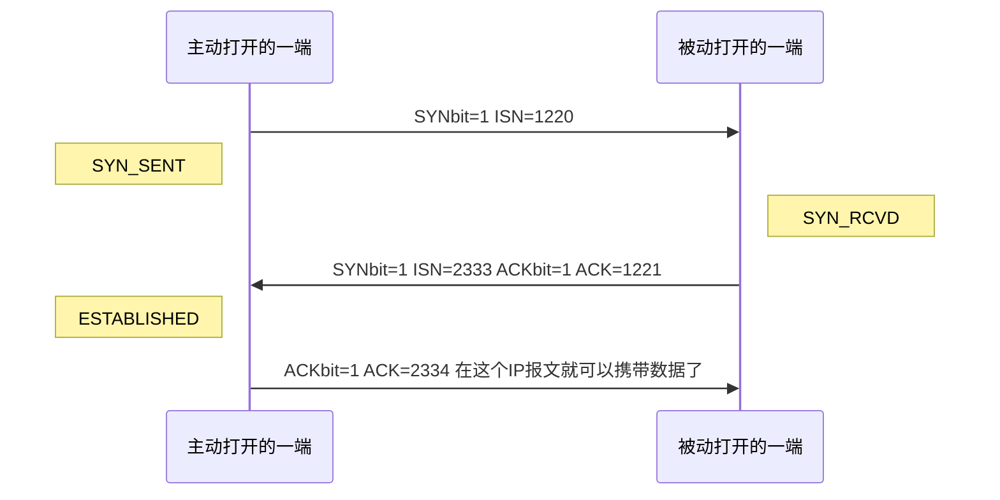
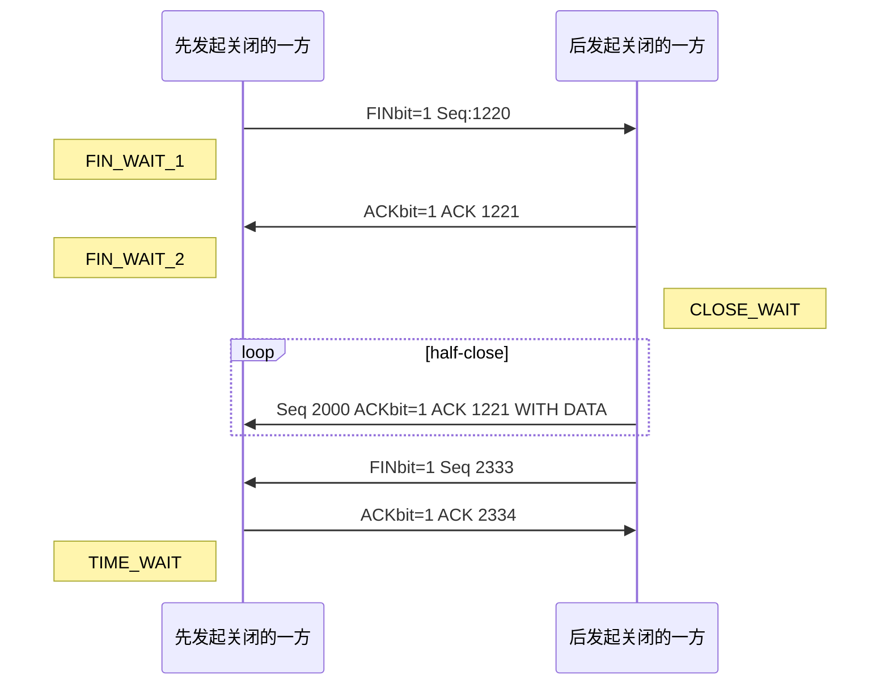

---
categories:
  - net
---
# TCP

- Transfer Control Protocol 传输控制协议
- 传输层协议
- 提供一种面向连接的、可靠的 **字节流服务**

[TOC]

## 协议提供的服务

## 协议的实现

### 报文的结构

#### 首部 $4 \times 5$ 字节

- 16位源端口号 16位目的端口号

  - 四元组 *两个端口号 两个ip地址* 唯一确定一个TCP连接

- 32位序号

  - **用来标志从该报文段第一个数据字节在流中的位置**
  - 无符号数 ，溢出后从0开始
  - **当SYN=1时，为该报文段发送者选定的这个链接的初始序号**

- 32位确认序号

  - 用来表示 **该报文段发送方** 期望收到的 **下一个序号**

- 4 首部长度 6 保留 6 (URG|ACK|PSH|RST|SYN|FIN) 16 窗口大小

  - 首部长度
  - URG 紧急指针
  - ACK 标志确认序号有效
  - PSH 接收方应当尽快将这个报文段交给应用层
  - RST 重建链接
  - SYN 当新建立一个连接的时候 SYN位置1

  - FIN 发送端完成发送任务
  - 窗口大小

- 16 检验和 16 紧急指针

  - 检验和
    - 覆盖TCP首部和TCP数据
    - 与UDP检验和计算类似
    - 使用伪首部
  - 紧急指针

#### TCP数据

TCP数据是可选的

### TCP连接的建立与终止

#### 建立 三次握手

- ISN（初始序号）随时间变化



#### 终止 四次分手

- 因为 **半关闭 half-close** 造成的。由于TCP是全双工的，必须每个方向都能够独立的关闭



#### 经典的状态变迁图


#### 经典的TIME_WAIT问题

> TIME_WAIT状态也叫做2MSL等待状态
>
> MSL 报文段最大生存时间 Maximum Segment Lifetime

- 作用

  - 防止上一个TCP连接的延迟数据包影响下一个TCP连接

  - 确保TCP连接的正常关闭。

    > 可让TCP再次发送最后的ACK以防这个ACK丢失(另一端超时并重发最后的FIN )。 

    - 其中 **最后的ACK** 和 **这个ACK** 指的是应答被动关闭的一方发送的FIN而发送的ACK （猜测 这样会重置TIME_WAIT的等待时间）

    ```mermaid
    sequenceDiagram
    	participant m as 发起终止
    	participant s as 被动终止
    	m ->> s: 发起终止 FIN
    	note left of m: FIN_WAIT_1
    	s ->> m: 响应 FIN ACK
    	note right of s: Last_ACK
    	note left of m: TIME_WAIT
    	m ->> s: 最后的ACK 没有接收到
    	note right of s: Last_ACK
    	s ->> m: 因为超时 再次发送FIN_ACK
    	m ->> s: TIME_WAIT再次发送最后的ACK
    	note left of m: still TIME_WAIT
    
    	
    ```

- 导致在2MSL内，定义该TCP连接的四元组不能重用 或者 更严格的 该本地端口在默认的情况下不能再被使用

- 解决方案

  1. 增加四元组中的任何一个元素 

     1. 增加可用端口范围ip_local_port_range
     2. 在多个端口增加服务器监听
     3. 如果采用了类似反向代理，可以增加反向代理的ip数

  2. SO_REUSEADDR

     1. 如果在一个socket绑定到某一地址和端口之前设置了其`SO_REUSEADDR`的属性，那么除非本socket与产生了尝试与另一个socket绑定到 **完全相同的源地址和源端口组合** 的冲突，否则的话这个socket就可以成功的绑定这个地址端口对。
     2. 对于 **Linux** 来说，对于0.0.0.0:port来说，无论开启与否，只要是绑定到port上，都无法重绑定

  3. linger time

     - kernel强制关闭一个socket的最长时间

  4. tcp_tw_reuse

     - 原理

       - 每个连接带有时间戳，可以通过时间戳的全序关系来避免旧的包影响到新的连接，在内核认定安全的情况下，会重用socket

       ```c
       int tcp_twsk_unique(struct sock *sk, struct sock *sktw, void *twp)
       {
       	const struct tcp_timewait_sock *tcptw = tcp_twsk(sktw);
       	struct tcp_sock *tp = tcp_sk(sk);
       
       	/* With PAWS, it is safe from the viewpoint
       	   of data integrity. Even without PAWS it is safe provided sequence
       	   spaces do not overlap i.e. at data rates <= 80Mbit/sec.
       
       	   Actually, the idea is close to VJ's one, only timestamp cache is
       	   held not per host, but per port pair and TW bucket is used as state
       	   holder.
       
       	   If TW bucket has been already destroyed we fall back to VJ's scheme
       	   and use initial timestamp retrieved from peer table.
       	 */
       	if (tcptw->tw_ts_recent_stamp && // 开启了timestamp
       	    (twp == NULL || (sysctl_tcp_tw_reuse && // 开启了reuse
       			     get_seconds() - tcptw->tw_ts_recent_stamp > 1))) {// 最后接收到超过一秒
       		tp->write_seq = tcptw->tw_snd_nxt + 65535 + 2; // 增加序号
       		if (tp->write_seq == 0)
       			tp->write_seq = 1;
       		tp->rx_opt.ts_recent	   = tcptw->tw_ts_recent; // 重用socket
       		tp->rx_opt.ts_recent_stamp = tcptw->tw_ts_recent_stamp;
       		sock_hold(sktw);
       		return 1;
       	}
       
       	return 0;
       }
       ```

       

     - **一定要开启tcp_timestamps**

     - 针对客户端来说，可以使用该方法解决TIME_WAIT过多的问题
       - 客户端有65535端口数的限制问题
     - 服务端无效

  5. tcp_tw_recycle **~~通常~~不要使用**

     - 在开启tcp_tw_recycle和tcp_timestamps两个选项之后，60秒内来源于同一个ip主机的socket connect中的时间戳必须要是递增的，否则会被丢弃

     - 比如说连接中存在NAT 必然是会出问题的 *NAT修改src ip但是不修改时间戳*

#### 复位报文段 RST位

- 请求不存在的端口
- 异常终止一个连接 *使用RST进行关闭而不是FIN*
- 如果对一个half-open连接发送消息，接收方丢失了连接，就会返回RST

### TCP针对交互数据流的处理

- Nagle算法
  - 要求一个TCP连接上最多只能有一个未被确认的未完成的小分组
  - 收集小分组，当ACK到达时一次性全部发送

### TCP针对成块数据流的处理

- 延迟ACK
- 滑动窗口
- 慢启动 *拥塞窗口 cwnd*
  - 每个连接cwnd初始化为1
  - 每收取一个ACK cwnd增加1

### TCP的超时与重传

- 对于每个连接，TCP维护四个计时器
  1. 重传定时器：计算收到另一端的确认的超时
  2. 坚持定时器：使窗口大小信息保持不断流动
  3. 保活定时器：检测一个空闲连接的另一端何时崩溃或重启
  4. 2MSL定时器：测量TIME_WAIT状态
- 拥塞避免算法
  - 拥塞窗口cwnd 和 慢启动阈值ssthresh
  - 算法流程
    1. 初始化，cwnd=1 ssthresh=65535
    2. cwnd逐步增加，直到发生拥塞 **（超时或收到重复确认）到这为止都是慢启动**
    3. 发生拥塞：
       - 重复确认：ssthresh置为cwnd的一半
       - 超时：ssthresh置为cwnd的一半 cwnd置为1
    4. cwnd逐步增加
       - cwnd <= ssthresh 每个ACK $cwnd += 1MSS$ **这里是慢启动**
       - cwnd > ssthresh 每个ACK $cwnd += \frac{MSS}{cwnd}$  **这里是拥塞避免**
- 快速重传与快速恢复算法
  - 收到三个重复的ACK时，置 $ssthresh=\frac{cwnd}{2}$，重传丢失报文段，置 $cwnd = \frac{cwnd}{2} + 3MSS$
  - 随后每收到一个重复ACK，cwnd增加1MSS，并发送一个分组
  - 直到第一个确认新数据的ACK到达时，设置 $cwnd = ssthresh$ 
- 坚持定时器
- 保活定时器
- 2MSL定时器

## TCP的未来

- 路径MTU发现
- 长肥管道
  - $capacity=bandwidth(b/s)\times rount-trip time(RTT)$
  - capacity称为带宽时延乘积
  - 一个具有大capacity的网络称为长肥网络
  - 问题
    - 需要更大的窗口提高大吞吐量 *（RTT大）*
    - 分组丢失会造成吞吐量的急剧减少
    - RTT需要更好的测量方法
    - 序号有限，会短时间内发生回绕 *（带宽变大 发送相同数量包的时间减少）*

## 参考

- [从SO_REUSEADDR选项说起](https://zhuanlan.zhihu.com/p/31329253)
- [浅析套接字中SO_REUSEPORT和SO_REUSEADDR的区别](https://blog.csdn.net/yaokai_assultmaster/article/details/68951150)
- [tcp_tw_reuse、tcp_tw_recycle 使用场景及注意事项](https://www.cnblogs.com/lulu/p/4149312.html)
- UNP
- TCP-IP详解卷一：协议