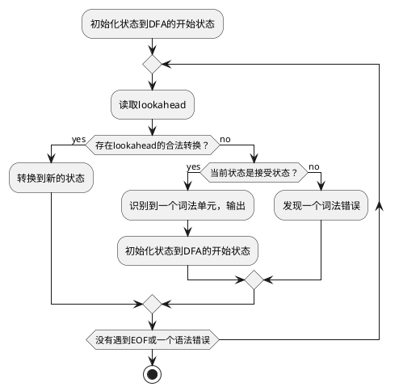

第三章在第二章的基础上，
介绍了构建**词法分析器**的技术。

<!--more-->

{}

# 简介

**词法分析器**：
1. 读取源程序，
1. 处理空白字符与注释，
1. 维护源程序信息（用于错误提示等用途）
1. 和识别词素生成词法单元。

## 词法单元、模式与词素

- **词法单元** *(token)* 是由**词法单元名**与一系列相关的属性构成的一个数据结构实例。
- **词素** *(lexem)* 表示源程序中的一个具体的、与某种**词法单元**匹配的字符序列。
- **模式** *(pattern)* 用来描述**词法单元**可以匹配的**词素**的规则。

# 什么是语言

3.3.1依次给出若干定义来导出最后的**语言**的定义。

**字母表** *(alphablet)* 是一个有限的符号集合，
具体的，是一个语言源程序所包含的全部可能的字符。

一个**串** *(string)* 是一个具体的**字母表**中的符号构成的**有穷序列。

一个**语言**是一个在具体的**字母表**上产生的任意可数的**串**组成的集合。

# 定义语言的模式

3.3.3开始介绍了如何利用正则表达式定义**模式**。

# 根据模式识别词法单元 

3.4引入了**状态转换图** *(transition diagram)* 来识别词法单元。
核心思想为通过检查所有**模式**的前缀来确定当前读取到的字符序列的词法单元，
如果发生分歧，如不能唯一的确定，将会应用适当的策略（如最长匹配）来保证结果的唯一。

**状态转换图**中的节点表示状态，
边表示从一个状态迁移到下一个状态时需要读取的符号。

考虑到识别词法单元需要多次字符串匹配，
所以引入了KMP算法来提高匹配的效率。

# 词法分析器生成工具Lex

3.5介绍了词法分析器生成工具Lex。

# 手动构造词法分析器

3.6介绍了Lex的工作原理：**有穷自动机** *(finite automata)* 。

## 有穷自动机

本质上，**有穷自动机**是与**状态转换图**类似的图；
表现为一个**识别器** *(recognizer)* ，
能够对输入的**串**返回是或否。

**有穷自动机**根据：

1. 任意节点否存在一个**符号**匹配多个离开该节点的边和
1. 是否支持空串分为

**不确定的有穷自动机** *(Nondeterministic Finite Automata, NFA)* 和
**确定的有穷自动机** *(Deterministic Finite Automata, NFA)* 。

一个**有穷自动机**表示的语言是它从**开始状态**到任意**结束状态**所有路径上的标号串的集合。

## 正则表达式转换为NFA

### 一个简化的正则表达式

第三章给出了一个简化版的正则表达式，
在以下的表达中不再特殊指出。
定义$r$表示一个正则表达式，
$L(r)$表示$r$能匹配的字符串集合。
定义三个运算：

1. 连接运算 $L(rs) = L(r) \times L(s)$
1. 并运算 $L(r|s) = L(r) \cup L(s)$
1. 闭包运算 $L(r*) = \cup^{\infty}_{i=1}L(r^i) \$

    其中$L(r^n) = L(r) \times L(r^{n-1})$。

### 将正则表达式转化为NFA

*McNaughton-Yamada-Thompso算法*

1. 将复杂的正则表达式拆分为子表达式。

    **子表达式**是不包含运算符的表达式。

1. 将子表达式转换为NFA。

    对于一个**符号表**中的符号，
    新建两个状态：开始状态与接受状态，
    从开始状态接受该符号到达接受状态。

1. 将子表达式构成的NFA组合成目标表达式的NFA。

    根据子表达式之间的运算符，有不同的合成规则：

    1. 对于**连接运算**，将前一个NFA的接受状态作为后一个NFA的开始状态即可。

    1. **并运算**

        1. 构建两个状态作为新NFA的开始状态和接受状态，
        1. 将开始状态通过接受空串$\epsilon$连接到子表达式的NFA的开始状态上
        1. 类似的，将子表达式的NFA的接受状态，通过$\epsilon$连接到新NFA的接受状态上。

    1. **闭包运算**

        首先新增一个路径，从子表达式的接受状态上接受$\epsilon$转换到子表达式的开始状态。
        因为**闭包运算**能够接受空串，所以增加两个状态作为新NFA的开始状态与接受状态，
        有一个接受空串的转换。
        最后，将修改过的子表达式通过空串跳转连接到新NFA中。

## NFA转换为DFA 子集构造法

因为处理NFA支持的空串和一个符号支持多种状态转换较为困难，
所以考虑将NFA转换为支持相同语言的DFA来进行模拟。

转换通过**子集构造法** *(subset construction)* 来实现。
**子集构造法**的核心思想在于将任意一个NFA状态接受同一个符号之后可能处于的状态集合（以下称为**结果状态集合**）作为DFA的一个状态；
考虑到空串的问题，
**结果状态集合**还需要包括从之前的结果状态集合仅接受空串即可到达的状态。

根据上述的转换算法，给出三个定义：

1. $\epsilon-closure(s)$ 表示从NFA状态s仅接受空串便可以转换到的**结果状态集合**。
1. $\epsilon-closure(T)$ 表示从NFA状态**集合**T仅接受空串便可以转换到的**结果状态集合**，
即$\epsilon-closure(T) = \cup_{s \in T}\epsilon-closure(s)$。
1. $move(T, a)$ 表示NFA状态**集合**T接受了输入符号a后可以转换到的**结果状态集合**。

**子集构造算法**可以表示为：

1. 初始化DFA的状态集合与转换表，向DFA状态集合中增加DFA的**开始状态**（一个仅包括NFA的**开始状态**的集合）。
1. 循环直到DFA状态集合中不存在没有遍历过的状态。
    1. 当前的DFA状态称为$S$。
    1. 遍历**符号表**中的所有符号，计算$\epsilon-closure(move(S, symbol))$作为状态$D$。
    1. 向DFA转换表中写入类似状态$S$接受$symbol$转换为$D$的记录。
    1. 如果DFA状态集合中没有$D$，则将$D$加入其中。
1. 最后，将包含NFA**接受状态**的DFA状态标记为DFA的**接受状态**。

## 模拟DFA识别词法单元

# 基于DFA的模式匹配器的优化

# 参考
