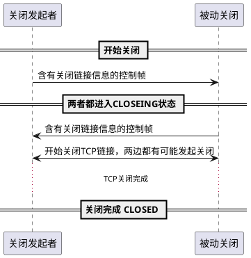

之前没有机会用到websocket，也没有认真的了解过，
新的工作里看起来经常会用到，所以简单的了解一下协议的一些细节，以及一些实践。

# websocket是什么

首先给出一个简单的结论：websocket是一个由HTTP启动、基于TCP、支持全双工通信的以帧为传输单位的通信协议。

HTTP/2及之前的协议，都没有提供服务端与客户端双向通信的支持。
当然可以通过SSE(Server-Sent Events 服务器推送事件)来完成从服务端到客户端的推送
和正常的HTTP请求完成从客户端到服务端的传输来实现双向通信的需求，
但这实在看起来有点奇怪。
为了解决双向通信的需求，增加了websocket这个协议。


# websocket是如何运作的呢？

初代websocket是基于HTTP/1实现的，那么我们先从最一开始的版本开始。

## 总览

websocket协议有两个阶段：
1. 握手
1. 传输数据

因为websocket中有链接的概念，
那么建立一个链接自然需要通过握手来使双方维护好链接。
出于兼容性的考虑，
websocket的握手的过程基于HTTP/1.1实现。

首先，客户端向服务端发送一个握手请求：

```http
GET /chat HTTP/1.1
Host: server.example.com
Upgrade: websocket
Connection: Upgrade
Sec-WebSocket-Key: dGhlIHNhbXBsZSBub25jZQ==
Origin: http://example.com
Sec-WebSocket-Protocol: chat, superchat
Sec-WebSocket-Version: 13
```

当服务器接收到握手请求时，做出回应：
```http
HTTP/1.1 101 Switching Protocols
Upgrade: websocket
Connection: Upgrade
Sec-WebSocket-Accept: s3pPLMBiTxaQ9kYGzzhZRbK+xOo=
Sec-WebSocket-Protocol: chat
```

经过一来一回，链接便建立成功，进入下个阶段：传输数据。

数据在链接中的传输单位是`message`，每个消息是若干同类型`frame`的组合。

`frame`是传输的数据的最小单元，根据存储数据的内容，被划分为若干类型。

## 握手

websocket用`ws`或`wss`作为协议的标记，`wss`表示基于tls加密的websocket。

客户端发起握手请求，如果不指定端口，则复用HTTP或HTTPS的默认端口。

握手请求具体为：

```http
GET /chat HTTP/1.1
Host: server.example.com
Upgrade: websocket
Connection: Upgrade
Sec-WebSocket-Key: dGhlIHNhbXBsZSBub25jZQ==
Origin: http://example.com
Sec-WebSocket-Protocol: chat, superchat
Sec-WebSocket-Version: 13
```

首先要关注的是请求中的`Connection: Upgrade`和`Update:websocket`，
这是在利用HTTP/1.1的协议协商机制（HTTP/2也是利用该协议来探测服务器是否支持HTTP/2）来尝试使用websocket协议。

除此之外，还有三个header用于websocket的配置：
- `Sec-WebSocket-Key` 用于区分websocket链接
- `Sec-WebSocket-Protocol` 客户端支持的子协议
- `Sec-WebSocket-Version` 必须为13
- `Sec-WebSocket-Extensions`表明客户端支持的websocket的扩展类型

接下来是服务器端的工作。
在接收到客户端发来的握手请求后，
需要返回相应的结果，来完成协议的升级。
这部分工作分为两部分：
1. 协议协商机制的完成
1. websocket协议的完成

下面先看下对应的返回内容：

```http
HTTP/1.1 101 Switching Protocols
Upgrade: websocket
Connection: Upgrade
Sec-WebSocket-Accept: s3pPLMBiTxaQ9kYGzzhZRbK+xOo=
Sec-WebSocket-Protocol: chat
```

首先是状态码、`Upgrade`和`Connection`三者完成了协议升级。

然后是websocket协议的完成：
- `Sec-WebSocket-Protocol`表示服务器选定的子协议
- `Sec-WebSocket-Accept`用于区分websocket链接

特别的，`Sec-WebSocket-Key`和`Sec-WebSocket-Accept`结合起来用于确认服务端支持了websocket协议且服务端确实接受了链接。
两者的计算方式如下：

1. 客户端发起链接的时候，随机产生一个16字节的字符串`nonce`。
1. 将`Sec-WebSocket-Key`设置为base64(nonce)`，发送请求。
1. 服务端接收到`Sec-WebSocket-Key`，将其与一个固定的UUID(258EAFA5-E914-47DA-95CA-C5AB0DC85B11)拼接，随后进行sha1运算，然后进行base64计算。
1. 将`Sec-WebSocket-Accept`设置为上一步计算的值，返回给客户端。

客户端收到后会校验该值，如果不一致，表明服务器不支持websocket协议或链接错乱。

至此，websocket握手完成。

## 传输数据

按前述，websocket协议用一系列帧来传输数据。

首先看下帧的格式：

```ditaa
@startuml
skinparam defaultFontName Microsoft YaHei
ditaa(-E --no-shadows -e utf8)
+--+-+-+-+-------+-+-------------+------------------------------+
|F |R|R|R| opcode|M| Payload len |   Extended payload length    |
|I |S|S|S|  (4)  |A|     (7)     |            (16/64)           |
|N |V|V|V|       |S|             |  (if payload len==126/127)   |
|  |1|2|3|       |K|             |                              |
+--+-+-+-+-------+-+-------------+- - - - - - - - - - - - - - - +
|     Extended payload length continued, if payload len eq 127  |
+ - - - - - - - - - - - - - - - +-------------------------------+
|                               |Masking key, if MASK set to 1  |
+-------------------------------+-------------------------------+
| Masking key (continued)       |                               |
+-------------------------------+                                
|                                                               |
                                                                 
|                     Payload Data (Extension data)             |
                                                                 
|                                                               |
+ - - - - - - - - - - - - - - - - - - - - - - - - - - - - - - - +
|                                                               |
                                                                 
|                     Payload Data (Application data)           |
                                                                 
|                                                               |
+---------------------------------------------------------------+
@enduml
```

- FIN 标记是否是一个`message`的最后一个帧。
- RSV1/RSV2/RSV3 用于协商好的扩展使用
- Opcode 表明帧存储的数据是什么类型的
  - 0x0 continuation frame?
  - 0x1 文本帧
  - 0x2 二进制帧
  - 0x8 关闭链接
  - 0x9 ping
  - 0xA pong
- Mask 用于标记载荷是否经过mask
- Payload len 用于标记载荷的长度
  - 长度小于126时，使用7bit
  - 长度大于126时
    - 设置原有的7bit为126，表明使用后续的32位表示长度
    - 设置为127，表明用后续的64位表示长度
- Masking key 用于进行mask的key，如果有，那么占用4字节
- Payload Data 载荷数据
  - Extension data 协商好的扩展使用的数据
  - Application data 数据

格式中不太直观的有两个点，一个是mask，另一个是Opcode。

### Mask


## 断开链接

为了让通信的中间组件能更好的处理websocket的关闭，协议被设计为断开也需要进行协商。



要断开链接的一端，发送一个控制帧，内容为状态码和关闭原因。
当一端发送并接受到了关闭链接的控制帧后，意味着websocket链接断开，程序就应该开始关闭底层的TCP链接。


# 参考

- [rfc6455](https://tools.ietf.org/html/rfc6455)
- [MDN 服务器推送事件](https://developer.mozilla.org/zh-CN/docs/Server-sent_events/EventSource)
