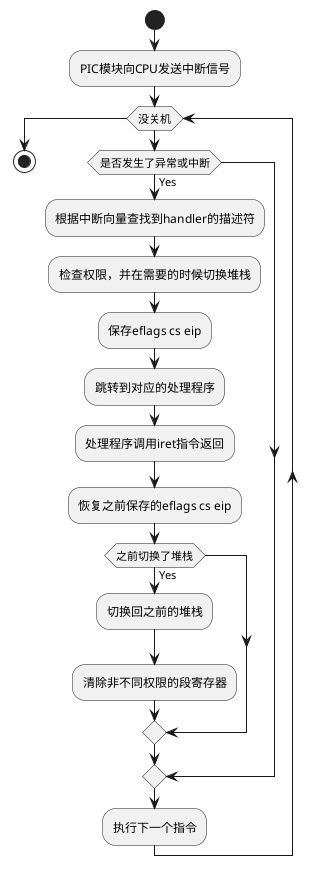
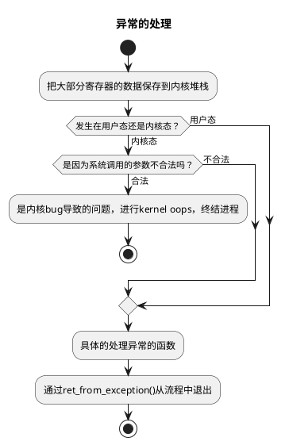
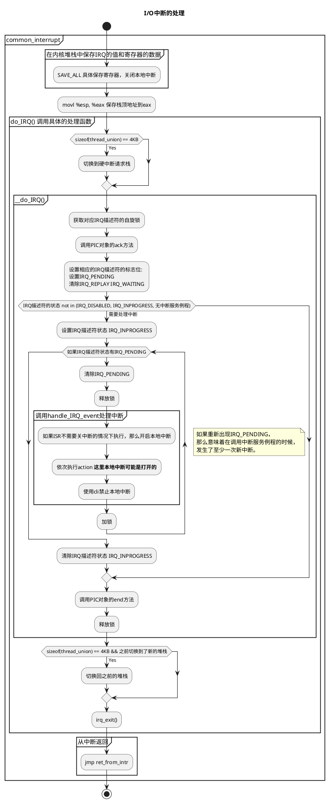

# 中断与异常的关系

刚开始看中断、异常相关的资料的时候，一直没有搞清楚两者的区别，导致一直是云里雾里、一头雾水，感觉资料怎么都是互相矛盾的啊。

其实在不同的资料里，各个名词的含义可能是不同的，特别是**中断**。

本文用ULK代指《深入理解Linux内核》。

~~ULK的翻译错误是真的有点多~~

## 什么是中断？

先介绍一下广义上的中断。

引用下《深入理解Linux内核》对中断的定义：

> An interrupt is usually defined as an event that alters the sequence of instructions
executed by a processor. Such events correspond to electrical signals generated by
hardware circuits both inside and outside the CPU chip.

中断是一个事件，被用来改变处理器执行既定指令流程。我认为中断提供了实现异步的基础。

## 同步中断与异步中断

将**中断**分为**同步中断**和**异步中断**。

- 同步中断是CPU控制单元在执行每个指令时产生的。**同步**是因为这种中断一定是每个指令执行完后，才会被发出的。

- 与此相对的是异步中断，由外围设备产生，在任何时间都有可能产生。

## 异常是什么呢？

在Intel的手册中，将同步中断称为**异常**，将异步中断叫做中断。

## 小结

所以在看相关的资料的时候，第一步要做的就是，确定相关名词在资料中的含义。

# 中断、异常的分类


# 硬件上的

1. 可编程中断控制器 Programmable Interrupt Controller
1. I/O Advanced Programmable Interrupt Controller

# Linux上的处理流程

## 硬件上，中断与异常的处理流程是一样的



## 中断上下文与为什么中断服务例程不能发生进程切换。

中断与异常的处理函数（以下简称处理函数）运行在`中断上下文(interrupt context)`中，相较于进程上下文，更轻量，且没有进程的概念。

这意味着在处理函数中进行进程切换是无意义的，因为没有可以调度的进程。

在ISR中不能进行进程切换，我理解是一种**设计思路**，这样的设计会让ISR的实现简洁清晰。
如果需要的话，我认为是可以实现一种在ISR中进行进程切换的OS的（在接收到ISR的时候开一个进程就好啦，当然细节很复杂）。
不过允许在ISR中进行进程切换是一件没有太大意义的设计，所以绝大多数操作系统都是不允许切换的。
至于通过工作队列实现进程切换算不算是ISR就是个人选择的问题了。

参考

- [[Quora]Why can't you sleep in an interrupt handler in the Linux kernel? Is this true of all OS kernels?](https://www.quora.com/Why-cant-you-sleep-in-an-interrupt-handler-in-the-Linux-kernel-Is-this-true-of-all-OS-kernels)
- [[Stackoverflow]Why kernel code/thread executing in interrupt context cannot sleep?](https://stackoverflow.com/questions/1053572/why-kernel-code-thread-executing-in-interrupt-context-cannot-sleep)

## 异常处理



## 中断处理

中断的处理与异常最大的不同是，中断会在任意时刻发生的，这个时候运行的进程和这个中断并无特别的联系，而异常一定是上一个指令产生的，这个时候一定是current这个进程造成的。

### I/O中断



### 时钟中断

todo

### 处理器间中断

类似于I/O中断的处理流程：

1. 保存寄存器
1. 压入向量号-256
1. 调用对应的高级C函数处理中断

## 从中断和异常中返回

从内核路径中返回到之前的运行环境，需要考虑内核抢占、是否返回到用户态、调试等情况。

# 提高中断与异常的响应速度

Linux根据响应中断要执行的操作的紧急程度分为三种：

- 紧急的 critical
- 非紧急的 noncritical
- 非紧急可延迟的 noncritical deferrable

中断服务例程将可延迟的工作交给`可延迟函数`和`工作队列`执行来尽可能的减少中断服务例程中的耗时来实现提高响应速度的目的。

中断服务例程使用可延迟函数来执行`非紧急可延迟的操作`。

## 可延迟函数：软中断与tasklet

首先注意概念与名词的混淆：

1. **软中断有的时候表达的其实是可延迟函数**
1. **软中断有的时候表达的是编程异常**

**本文中的软中断都特指可延迟函数中的软中断。**

可延迟函数是一种预定义好的、用于处理特定中断的对象。

可延迟函数有如下的几个接口可以被调用：

- 初始化

    初始化该可延迟函数的结构。

- 激活

    标记该可延迟函数为`pending`，这意味着在下次可延迟函数的调度中需要被执行。

    *《深入理解Linux内核》翻译的是挂起，可能会和 `suspend` 产生混淆。*

- 屏蔽

    禁止一个可延迟函数的执行。

- 执行

    执行所有同类型的可延迟函数。

### 软中断

软中断目前有六种，优先级由高到低排列：

1. HI_SOFTIRQ

    执行高优先级的`tasklet`。

1. TIMER_SOFTIRQ
1. NET_TX_SOFTIRQ
1. NET_RX_SOFTIRQ
1. SCSI_SOFTIRQ

    SCSI(small computer system interface)命令的后台中断处理。

1. TASKLET_SOFTIRQ

#### 相关的数据结构

1. 我称为`软中断描述符`的`softirq_action`，定义了一个可延迟函数。

1. 当前进程或内核线程的`thread_info.preempt_count`字段，
标记了禁用内核抢占的次数、可延迟函数的禁用次数、本地CPU上的中断嵌套层数。

1. 每个CPU都会维护一个掩码，用于保存当前有多少挂起（即待执行）的软中断。

#### 相关的流程

```plantuml
start
partition 触发软中断执行的时机 {
    fork
        :local_bh_enable();
    fork again
        :1. do_IRQ()结束，调用irq_exit()时。
        ULK的翻译有点问题，不是或。
        2. smp_apic_timer_interrupt()完成本地定时器中断时。
        3. 完成CALL_FUNCTION_VECTOR处理器间中断时。;
    fork again
        :ksoftirqd/n线程执行时\nkernel soft interrupt request daemon;
    end fork
}
partition do_softirq() {
    if (调用`in_interrupt()`检查是否在中断上下文中或是否禁用软中断) then (No)
        :保存IF标志，禁用中断;
        :如果thread_union大小为4KB，切换为软中断栈;
        partition __do_softirq() {
            :保存本地CPU有哪些软中断需要执行;
            :通过preempt_count中的软中断计数器加一，禁用软中断;
            while (循环次数小于固定值 && 有需要执行的软中断) is (true)
                :清除软中断掩码，以便可以激活新的软中断;
                :开中断;
                :根据保存下来的pending的软中断，依次执行对应的action;
                :关中断;
                :保存本地CPU有哪些软中断需要执行;
            endwhile
            if (还有需要执行的软中断？) then (yes)
                :通过wakeup_softirqd()调度内核线程来执行待执行的软中断;
            endif
            :premmpt_count中的软中断计数器减一;
        }
        :如果切换了栈，那么切换回去;
        :重载之前保存的IF标志;
    endif
}
stop
```

### tasklet

tasklet基于`HI_SOFTIRQ`/`TASKLET_SOFTIRQ`两种软中断实现。

tasklet的处理流程类似软中断，主要的不同在于，同类型的tasklet同时只会运行一个。

## 工作队列:

工作队列是另一种执行可延迟工作的工具。

调用方向工作队列提交任务，随后，任务由叫做`工作者线程`的内核线程执行。

与可延迟函数最大的不同在于，工作队列中的函数运行在`进程上下文`中，这意味着，工作队列中的函数可以执行阻塞进程的操作，如访问磁盘。

### 创建工作队列

使用`create_workqueue(queue_name)`创建一个有CPU个数工作者线程的工作队列。

使用`create_singlethread_workqueue(queue_name)`创建只有一个工作者线程的工作队列。

### 向工作队列加入任务

加入流程比较简单，检查是否在队列中后，append到任务链表，尝试唤醒等待新任务的工作者线程。

又有函数可以延迟一定tick数后将任务append到队列中。

### 通常使用系统预定义的`events`队列

### 要注意的是，工作队列中的函数时串行执行的，尽量不要让任务阻塞太长时间

## 为低响应延迟做的trade-off

不管是中断的响应还是用户态程序，我们都希望能够尽快的被执行。

这个目标需要考虑以下几个要素：

1. 不论是中断的发生还是等待执行的用户态程序数量都可能突然的增多。
1. 中断会在任意时刻发生，包括中断被处理的时候。
1. 更多的情况下，希望的是稳定的延迟；如果可能，应该尽量避免延迟突增的情况。

为了解决以上的问题，通过引入任务优先级(Critical,Noncritical, Noncritical deferrable)和限流（限制每次调度，执行可延迟函数循环的次数和引入ksoftirqd内核线程）做到了平衡。

通过拆分任务的优先级，可以将一些操作延后操作，提高短时间的中断吞吐。

通过限制每次执行有限次数的可延迟函数循环和较低优先级的内核线程，处理可延迟函数时再激活的可延迟函数的情况。

1. 如果不执行处理可延迟函数时激活的可延迟函数，那么可延迟函数的延迟就会增加。
1. 如果执行完直到没有挂起的可延迟函数，那么其他进程的延迟就会增加。

只处理有限次保证了可延迟函数不会出现长时间阻塞其他进程的情况。通过较低优先级的内核线程继续处理，可以实现：负载较高的情况下，不阻塞用户程序；负载较低的情况下，快速执行。
