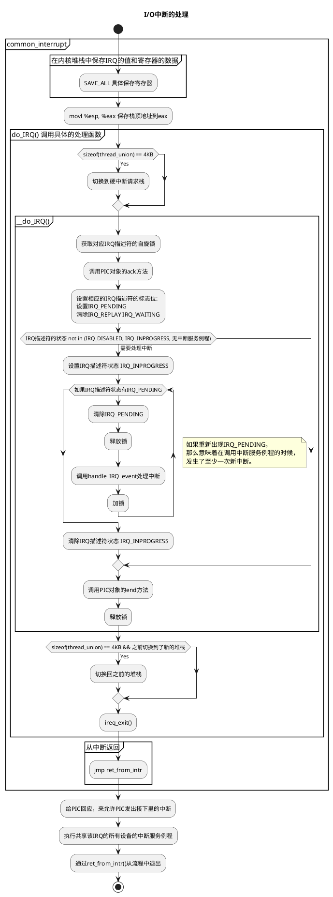

# 中断与异常的关系

刚开始看中断、异常相关的资料的时候，一直没有搞清楚两者的区别，导致一直是云里雾里、一头雾水，感觉资料怎么都是互相矛盾的啊。

其实在不同的资料里，各个名词的含义可能是不同的，特别是**中断**。

## 什么是中断？

先介绍一下广义上的中断。

引用下《深入理解Linux内核》对中断的定义：

> An interrupt is usually defined as an event that alters the sequence of instructions
executed by a processor. Such events correspond to electrical signals generated by
hardware circuits both inside and outside the CPU chip.

中断是一个事件，被用来改变处理器执行既定指令流程。我认为中断提供了实现异步的基础。

## 同步中断与异步中断

将**中断**分为**同步中断**和**异步中断**。

- 同步中断是CPU控制单元在执行每个指令时产生的。**同步**是因为这种中断一定是每个指令执行完后，才会被发出的。

- 与此相对的是异步中断，由外围设备产生，在任何时间都有可能产生。

## 异常是什么呢？

在Intel的手册中，将同步中断称为**异常**，将异步中断叫做中断。

## 小结

所以在看相关的资料的时候，第一步要做的就是，确定相关名词在资料中的含义。

# 中断、异常的分类

# 硬件上的

1. 可编程中断控制器 Programmable Interrupt Controller
1. I/O Advanced Programmable Interrupt Controller

# Linux上的处理

## 异常处理

## 中断处理

### I/O中断处理

Linux根据响应中断要执行的操作分为三种：

- 紧急的 critical
- 非紧急的 noncritical
- 非紧急可延迟的 noncritical deferrable

