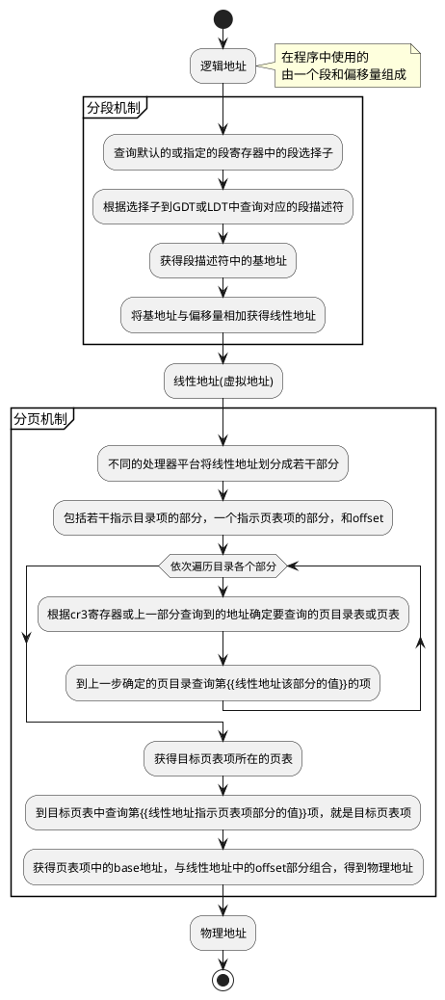
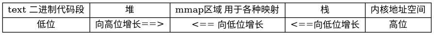
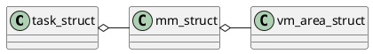

# 分段与分页基础



## TLB

Translation lookaside buffer

用于缓存**线性地址到物理地址**的映射。

每个CPU都有一个，由操作系统决定什么时候失效。

## 硬件高速缓存

硬件高速缓存缓存了内存行，用于加速内存读写。

常说的L1 Cache就是一种硬件高速缓存。

每个CPU都有硬件高速缓存，**各个CPU之间的同步由硬件处理**。

像其他的缓存一样，写入的时候有两种策略：

- write back
- write through

# Linux中的分段

分段机制只在x86架构的平台上存在，Linux简单的使用分段机制。

Linux系统将逻辑地址与线性地址一一平铺的映射，即逻辑地址与线性地址是一致的。

实现上，最常用的有四个段：
- 用户数据段
- 用户代码段
- 内核数据段
- 内核代码段

其功能显然易见。

四个段从线性地址0开始映射，故逻辑地址与线性地址一致。

## GDT

Linux每个CPU有一个GDT，除了上述的四个段之外，有若干特殊功能的段以供使用。

### 任务状态段 TSS

每个CPU核心有一个TSS，有两个目的：

1. x86平台上，当从用户态切换到内核态时，CPU核心从TSS中获取并加载内核态堆栈。
1. 在用户态访问IO端口是，需要TSS中的IO许可权位图来做权限检查。

# Linux中的分页

Linux系统为兼容不同平台的分页机制，使用了四级分页模型：

- 页全局目录
- 页上级目录
- 页下级目录
- 页表

故线性地址看起来应该是这样的：


# 内存管理

系统对于内存的管理，向上，为程序提供统一的内存视图。向下，管理不同的物理内存。

- 程序运行时看到的内存视图，均为虚拟地址的视图。系统为每个进程初始化相同的虚拟地址视图。
  系统将虚拟地址视图划分为两部分，高位为内核地址空间，低位为用户地址空间，通常，两者按照用户地址空间3:1划分。
  
  ```plantuml
  @startdot
  digraph structs {
    node [shape=record];
    struct1 [label="{{ 用户地址空间 | 内核地址空间 } | 低位 ~ 高位}"];
  }
  @enddot
  ```

- 系统处理各种的硬件上的不同。

## 物理内存的管理

对于物理内存的管理，为处理一致内存访问与非一致内存访问，linux建立了**节点->内存域->页**的层级结构管理页帧。

### 相关的数据结构

- 节点描述符`pg_data_t` 处理一致内存访问与非一致内存访问。
- 内存域描述符`zone` 每个内存节点中，因为DMA等原因，物理内存其实有若干不同区域，通过内存域来处理这种不同。
- 页描述符`page` 每个物理页帧对应一个页描述符。

### 伙伴系统

在使用自举内存管理器完成初始化后，系统的物理内存管理由伙伴系统接手。

伙伴系统通过将内存按照2^n页（n称为阶）划分为若干固定大小的区域进行管理。
分配时，通过二分较大的区域，来分配较小的内存需求。
释放时，依次检查周围的区域是否能够组合成更大的（更大的阶）区域来适当的减少内存碎片。

## 内核内存管理

内核地址空间划分为若干部分：物理内存直接映射区、vmalloc区、永久内核映射、固定映射。

  ```plantuml
  @startdot
  digraph structs {
    node [shape=record];
    struct1 [label="{{{ 物理内存直接映射区域 | +896MB } | { { vmalloc区 | 永久内核映射 | 固定映射 } | 高端内存 }} | 3GB ~ 4GB}"];
  }
  @enddot
  ```

内核有两种获取内存的需要，一种是直接获取页，另一种是获取特定的对象。

### 内核获取页

获取页的有若干前端，最终都基于伙伴系统获取实际的物理页框。

内核将虚拟地址空间的高部分(通常为1/4)划为内核地址空间，用户态无法访问。

对于直接获取页的情况，分为：

- 直接映射到内核地址空间的物理页：分配好后可以直接通过线性地址使用。
- 未直接映射到内核地址空间的物理页：首先通过伙伴系统获取页框，后使用映射，将页框映射到内核地址空间的映射区（vmalloc/永久内核映射/固定映射/临时映射）。

### 获取特定对象通过基于伙伴系统的slab系统实现

slab系统可以简单的理解为对象池。

预先分配若干特定的对象，需要是申请，释放时归还。

## 用户空间内存管理



### 每个进程的控制块保存进程的线性地址使用情况

进程控制块`task_struct`包含一个`mm_struct`的结构，用于管理进程的内存使用情况。

`mm_struct`中包含一个线性地址从小到大排列的`vm_area_struct`链表，用于记录内存线性地址的使用情况。`vm_area_struct`实例同时维护在一个红黑树中。

每个`vm_area_struct`实例表示一个连续的线性地址区间。



### 申请内存

用户空间的程序使用系统调用向内核申请内存（比如使用`brk()`系统调用调整堆的大小）：

1. 内核设置页表项但不实际分配内存。
1. 程序访问该页，引起一个缺页中断，进入中断处理程序。[arch/x86/mm/fault_64.c#do_page_fault](https://elixir.bootlin.com/linux/v2.6.24/source/arch/x86/mm/fault_64.c#L295)
1. 中断处理程序检查各种情况，若为延迟分配导致的，将最终基于slab分配相应的页[mm/memory.c#handle_pte_fault](https://elixir.bootlin.com/linux/v2.6.24/source/mm/memory.c#L2467)，刷新缓存，从中断返回。

### 内存映射

系统抽象了一个`address_space`对象，用于表示可以映射为地址的对象。

举个例子，比如将硬盘上的文件映射到内存中，简化为两个地址空间的映射，大大减少了耦合。
