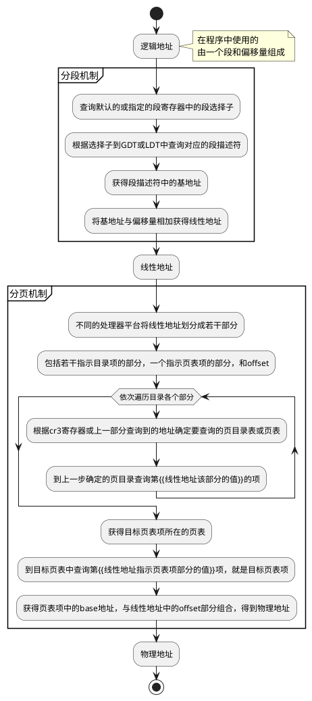

# 分段与分页基础

## TLB

Translation lookaside buffer

用于缓存线性地址到物理地址的映射。

每个CPU都有一个，由操作系统决定什么时候失效。

## 硬件高速缓存

硬件高速缓存缓存了内存行，用于加速内存读写。

常说的L1 Cache就是一种硬件高速缓存。

每个CPU都有硬件高速缓存，**各个CPU之间的同步由硬件处理**。

像其他的缓存一样，写入的时候有两种策略：

- write back
- write through

# Linux中的分段

分段机制只在x86架构的平台上存在，Linux简单的使用分段机制。

Linux系统将逻辑地址与线性地址一一平铺的映射，即逻辑地址与线性地址是一致的。

实现上，最常用的有四个段：
- 用户数据段
- 用户代码段
- 内核数据段
- 内核代码段

其功能显然易见。

四个段从线性地址0开始映射，故逻辑地址与线性地址一致。

## GDT

Linux每个CPU有一个GDT，除了上述的四个段之外，有若干特殊功能的段以供使用。

### 任务状态段 TSS

每个CPU核心有一个TSS，有两个目的：

1. x86平台上，当从用户态切换到内核态时，CPU核心从TSS中获取并加载内核态堆栈。
1. 在用户态访问IO端口是，需要TSS中的IO许可权位图来做权限检查。

# Linux中的分页

Linux系统为兼容不同平台的分页机制，使用了四级分页模型：

- 页全局目录
- 页上级目录
- 页下级目录
- 页表

故线性地址看起来应该是这样的：

# 动态内存分配

## 页框与相关的数据结构

