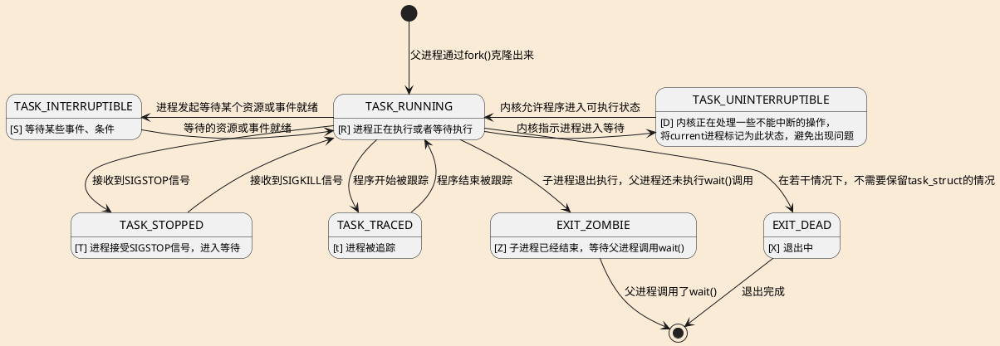

# 进程是什么

1. 是运行的二进制程序与其所拥有的资源集合。
1. 是调度的被操作者。

## `task_struct`

进程控制块，存储了进程的相关信息：

[task_struct definition](https://elixir.bootlin.com/linux/v2.6.24/source/include/linux/sched.h#L917)

- 进程自己的信息
- 命名空间
- 内存
- 文件
- 信号
- 资源限制
- ...

## 我是谁？

进程通过pid来辨别彼此。

通过指针关联父子和兄弟关系。

## 进程的一生

### 进程的产生

`fork()`/`clone()`/`vfork()`都依赖于[do_fork()](https://elixir.bootlin.com/linux/v2.6.24/source/kernel/fork.c#L1403)实现。

三者的原理类似，复制当前进程为子进程。区别在于`clone()`通过若干参数控制父子进程可以共享的资源。

其中使用了COW技术来避免无用的内存复制。

# 调度

## 调度是解决物理核心数量小于等待执行程序数量的方案

硬件上，只有若干核心可以同时执行程序。

当需要执行的程序大于核心的数量时，就需要调度机制来解决：

- 要换下一个进程执行吗？
- 换哪一个进程来执行？
- 如何切换进程？

## 调度的时机

发生调度的时机，要么是进程主动放弃CPU时间，要么是调度器认为当前进程不应该继续执行了（可能是高优的进程抢占，也有可能是进程的时间片耗尽了）。

主动放弃比较好理解，比如程序缺少执行的必要条件时，就会放弃执行，进入睡眠。

调度的核心函数[schedule()](https://elixir.bootlin.com/linux/v2.6.24/source/kernel/sched.c#L3619)实现了选择下一个运行的进程，并开始该进程执行。

调用`schedule()`主要分为两种：

1. 主动调用，用于当前进程无法继续执行了（如等待事件），立即切换进程。
1. 延迟调用，标记current进程的`TIF_NEED_RESCHED`，内核在恢复用户态进程执行（比如从中断服务例程返回）时，会检查这个标记并调用`schedule()`。
  1. `scheduler_tick()`函数依赖时钟中断，周期性的设置延迟调用。
  1. 当一个更高优先级的进程被唤醒时。

## 下个是谁？

这个选择由**调度策略**来决定。

得出一个好的答案需要考虑下面几个问题：

1. 有的时候，进程无法继续执行，那么就不能给他执行。
1. 进程与进程是不一样的，优先级是需要考虑的。~~有的进程在极端愤怒的情况下要求连续执行10ms~~
1. 不同的场景会对选择造成影响，比如飞控系统的调度。

## 我回来的时候，一切都不能变动哦

进程被来回切换后，要保证上下文不变。

这里牵扯比较多的硬件细节，简单来说，就是将程序的上下文（如寄存器）保存在相应的地方。
