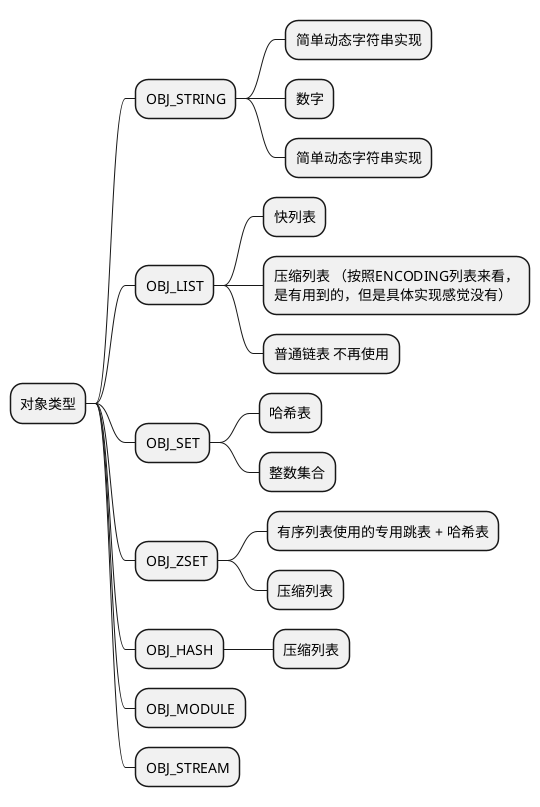

*redis 6.0*

redis在底层实现了若干数据结构：

- 简单动态字符串
- ~~双端链表~~ 快速列表
- 哈希表
- 跳表
- 整数集合
- 压缩表
- etc

但并不是直接使用这些数据结构构建系统，而是将这些数据结构封装成若干对象：

- 字符串
- 列表
- 哈希
- 集合
- 有序集合
- etc

对象之间有相似的结构，并实现了引用计数，以满足共享与内存回收的目的。

# 对象系统

## `redisObject`

```c
// src/server.h#233
typedef struct redisObject {
    unsigned type:4; // 类型
    unsigned encoding:4; // 编码
    unsigned lru:LRU_BITS; /* 内存逐出策略非LFU时，存储的是用来执行LRU的最后访问时间
                            * LFU data (least significant 8 bits frequency
                            * and most significant 16 bits access time). */
    int refcount; // 引用计数
    void *ptr; // 指向底层的数据结构
} robj;


// src/object.c#41
// 创建对象
robj *createObject(int type, void *ptr) {
    robj *o = zmalloc(sizeof(*o)); // 分配需要的内存
    o->type = type;
    o->encoding = OBJ_ENCODING_RAW;
    o->ptr = ptr;
    o->refcount = 1;

    /* Set the LRU to the current lruclock (minutes resolution), or
     * alternatively the LFU counter. */
    if (server.maxmemory_policy & MAXMEMORY_FLAG_LFU) {
        o->lru = (LFUGetTimeInMinutes()<<8) | LFU_INIT_VAL;
    } else {
        o->lru = LRU_CLOCK();
    }
    return o;
}
```

## 对象类型

`redisObject`中的`type`字段。

```c
// src/server.h#467
#define OBJ_STRING 0    /* 字符串 */
#define OBJ_LIST 1      /* 列表 */
#define OBJ_SET 2       /* 集合 */
#define OBJ_ZSET 3      /* 有序集合 */
#define OBJ_HASH 4      /* 哈希对象 */
#define OBJ_MODULE 5    /* 用于模块的对象 */
#define OBJ_STREAM 6    /* 流 */
```

## 对象编码

对于一种对象类型，底层的数据结构可能有若干种表示方式。
对象编码用来区分这些区别。

```c
// src/server#603
#define OBJ_ENCODING_RAW 0     /* SDS */
#define OBJ_ENCODING_INT 1     /* 整数 int */
#define OBJ_ENCODING_HT 2      /* 哈希表 hash table */
#define OBJ_ENCODING_ZIPMAP 3  /* zipmap */
#define OBJ_ENCODING_LINKEDLIST 4 /* （不再使用）链表 */
#define OBJ_ENCODING_ZIPLIST 5 /* 压缩列表 ziplist */
#define OBJ_ENCODING_INTSET 6  /* 整数集合 intset */
#define OBJ_ENCODING_SKIPLIST 7  /* 跳表 skiplist */
#define OBJ_ENCODING_EMBSTR 8  /* 嵌入简单动态字符串 Embedded sds string encoding */
#define OBJ_ENCODING_QUICKLIST 9 /* 压缩列表 链表 linked list of ziplists */
#define OBJ_ENCODING_STREAM 10 /* Encoded as a radix tree of listpacks */
```

## 对象类型与可选的编码



# 数据结构实现的简单分析

## 简单动态字符串

相较于原声的字符串，SDS有如下不同：

- 保存了长度
- 有预分配的空间
- 二进制安全（因为不需要依赖`\0`来标记结束）

```c
struct __attribute__ ((__packed__)) sdshdr64 {
    uint64_t len; /* used 字节数 */
    uint64_t alloc; /* excluding the header and null terminator */
    unsigned char flags; /* 3 lsb of type, 5 unused bits */
    char buf[];
};
```

## 压缩列表 ZIPLIST

*src/ziplist.c*

压缩列表的设计目的为及其节省空间的列表。

可以存储字符串和整数。

其存储格式如下：

1. zlbytes： 一个无符号整数存储压缩列表占用的字节数（包括这个无符号整数）。

1. zltail：一个无符号整数，表示尾部的偏移量。

1. zllen：表示列表中元素的数量。

1. entries：若干元素

    1. prevlen：前一个entry的长度，用于反向遍历。

    1. encoding：本身的编码，比如数字或字符串。对于字符串类型，还包括长度。

    1. entry-data：数据

1. zlend：一个表示列表结尾的特殊元素。

## 快速列表 QUICKLIST

快速列表是一个以压缩列表为节点的链表，被设计来代替普通的链表。

因为列表两端的使用频率较高，相对的，中部的节点可以再次压缩来提高内存使用效率。压缩使用了LZF算法。

```c
// src/quicklist.h#105
/* quicklist is a 40 byte struct (on 64-bit systems) describing a quicklist.
 * 'compress' is: 0 if compression disabled, otherwise it's the number
 *                of quicklistNodes to leave uncompressed at ends of quicklist.
 * 'fill' is the user-requested (or default) fill factor.
 * 'bookmakrs are an optional feature that is used by realloc this struct,
 *      so that they don't consume memory when not used. */
typedef struct quicklist {
    quicklistNode *head;
    quicklistNode *tail;
    unsigned long count;        /* 列表中的元素数量 */
    unsigned long len;          /* 列表节点数量 */
    int fill : QL_FILL_BITS;              /* 负载因子 fill factor for individual nodes */
    unsigned int compress : QL_COMP_BITS; /* depth of end nodes not to compress;0=off */
    unsigned int bookmark_count: QL_BM_BITS;
    quicklistBookmark bookmarks[];
} quicklist;

// 快速列表的节点
typedef struct quicklistNode {
    struct quicklistNode *prev; // 链表节点
    struct quicklistNode *next;
    unsigned char *zl;
    unsigned int sz;             /* 压缩列表字节数 */
    unsigned int count : 16;     /* 压缩列表中的元素数量 16bit */
    unsigned int encoding : 2;   /* 编码 RAW==1 or LZF==2 */
    unsigned int container : 2;  /* NONE==1 or ZIPLIST==2 */
    unsigned int recompress : 1; /* was this node previous compressed? */
    unsigned int attempted_compress : 1; /* node can't compress; too small */
    unsigned int extra : 10; /* more bits to steal for future usage */
} quicklistNode;
```

## 哈希表

一个常规的哈希表。

redis的核心也是由该数据结构来实现的。

*src/dict.c*

```c
// src/dict.h#48
typedef struct dict {
    dictType *type; // 一个接口，用于提供存储的元素的类型相关的操作函数
    void *privdata;
    dictht ht[2]; // 实际存储数据的地方，两个是用于rehash时使用。
    long rehashidx; /* rehash的进度 if rehashidx == -1 */
    unsigned long iterators; /* 当前使用中的迭代器 */
} dict;

typedef struct dictht {
    dictEntry **table;
    unsigned long size;
    unsigned long sizemask;
    unsigned long used;
} dictht;

// kv对 平平无奇
typedef struct dictEntry {
    void *key;
    union {
        void *val;
        uint64_t u64;
        int64_t s64;
        double d;
    } v;
    struct dictEntry *next;
} dictEntry;
```

### 最令人关注的自然是扩张与扩张时的访问。

`dictExpand()`时扩张的起点，简单的新建了一个`dictht`，并标记了`rehashidx`字段。

`dictRehash(dict *d, int n)`执行n次`rehash`操作：

1. 从`rehashidx`序号的桶开始，遍历n桶。
    1. 遍历桶中的`dictEntry`（KV对），将每个`dictEntry`放置到新的`dictht`中。
    1. 增加`rehashidx`，表示该桶已经`rehash`完成。
1. 检查是否已经全部迁移完成，如果完成，去除`rehash`标记。

**每个读写操作都会尝试执行`dictRehash`来推进进度。**

## 跳表

一个只能存储sds的跳表，太常规了。

*src/server.h#903*
```c
// 跳表的节点
typedef struct zskiplistNode {
    sds ele;
    double score;
    struct zskiplistNode *backward;
    struct zskiplistLevel {
        struct zskiplistNode *forward;
        unsigned long span; // 当前层，距离下个节点之间的元素数量
    } level[];
} zskiplistNode;

// 跳表实例结构
typedef struct zskiplist {
    struct zskiplistNode *header, *tail;
    unsigned long length;
    int level;
} zskiplist;
```

首先看下创建：

```c
zskiplist *zslCreate(void) {
    int j;
    zskiplist *zsl;

    zsl = zmalloc(sizeof(*zsl)); // 分配内存
    zsl->level = 1; // 初始化级别
    zsl->length = 0; // 表中元素数量？
    // 初始化一个节点
    // 最大分层，内容为空，分数为0
    zsl->header = zslCreateNode(/*level*/ZSKIPLIST_MAXLEVEL,/*score*/0,/*sds*/NULL);
    for (j = 0; j < ZSKIPLIST_MAXLEVEL; j++) {
        // 初始化各个level的值
        zsl->header->level[j].forward = NULL;
        zsl->header->level[j].span = 0;
    }
    zsl->header->backward = NULL;
    zsl->tail = NULL;
    return zsl;
}
```

创建好了就该插入，由`zslInsert`完成。
特别的，函数假定要插入的数据不在表中。

首先看下简单的原理示例图，演示了向[11,23,35,40,44]中插入28的过程。
插入从`zsl.header`开始，从左到右从上到下的检测插入的位置，
遍历了位置红黄蓝粉，最后定位到虚线标记的地方：
1. 首先从头节点开始（红色）。
1. 从最大的level2开始检查，下一个节点的值23（黄色），小于28。继续找下一个节点发现为空，那么向下开始查找level1（蓝色）。
1. level1查找下一个节点发现值40大于28，那么继续向下一层，到level0（绿色）。
1. 继续向后查找，直到发现35，且没有下一层，那么就应该在这里插入。

```ditaa
@startuml
ditaa
   zsl.header                                               
+--------------+                                                 
|  level_max   |                        update[2]                         |<---- span2 ---->|       
+--------------+                        update[1]                         :                 :  
| level_max-1  |                            |                           position            |   
+--------------+                            |                         to insert 28          |     
| level_max-2  |                            |                             :|                |      
+--------------+                            v                             :|                |     
| ............ |                        data node         update[0]       :|                |     
+--------------+                     +--------------+         |           vv                |     
|cREDlevel2    +-------forward------>+cYELlevel2    |         |         +=-----+            v       
+--------------+                     +--------------+         v         :      :           +------+            
|    level1    +-------forward------>+cBLUlevel1    +------------------------------------->|level1|         
+--------------+           +------+  +--------------+  +--------------+ :      : +------+  +------+  +------+
|    level0    +---------->|level0+->+    level0    +->|cPNKlevel0    +--------->|level0+->|level0+->|level0|
+--------------+  forward  +------+  +--------------+  +--------------+ |      | +------+  +------+  +------+
                           |  11  |  |     23       |  |      26      | :      : |  35  |  |  40  |  |  44  |
                           +------+  +---+----------+  +--------------+ +=-----+ +------+  +------+  +------+  
                              ^          |     |<--------- span1 --------->|
                              | backward |                 
                              +----------+                 other backward one by one        
@enduml
```

最后简单看下具体实现：

```c
zskiplistNode *zslInsert(zskiplist *zsl, double score, sds ele) {
    zskiplistNode *update[ZSKIPLIST_MAXLEVEL]; // 每一层要插入的位置前面第一个节点，即带颜色的节点
    zskiplistNode *x; // 遍历到的节点
    unsigned int rank[ZSKIPLIST_MAXLEVEL]; // 每一层update存储的节点之前有多少元素
    int i; // 当前level
    int level; // 要插入的节点需要有level层

    x = zsl->header; // 当前遍历到的节点
    // 遍历每个level
    for (i = zsl->level-1; i >= 0; i--) {
        // 继承上一层的元素数量
        rank[i] = i == (zsl->level-1) ? 0 : rank[i+1];
        // 遍历level中的节点，直到找到要插入的位置
        while (x->level[i].forward && // 当前level有下一个节点
                // 且下一个节点的分数小于当前要插入的节点的分数
                // （或分数相同且内容的字典序更小）
                (x->level[i].forward->score < score ||
                    (x->level[i].forward->score == score &&
                    sdscmp(x->level[i].forward->ele,ele) < 0)))
        {
            rank[i] += x->level[i].span; // 增加rank
            x = x->level[i].forward; // 下一个节点
        }
        update[i] = x; // 保存在i层上在在要插入位置前面的第一个节点，即图中带颜色的节点
    }
    // 随机获得一个这次插入的节点的level
    // 更高的level有更小的几率
    level = zslRandomLevel();
    if (level > zsl->level) { // 如果这次的层数之前表里没有
        // 填充之前level的rank和update信息
        for (i = zsl->level; i < level; i++) {
            // 都指向头节点
            rank[i] = 0;
            update[i] = zsl->header;
            update[i]->level[i].span = zsl->length;
        }
        zsl->level = level;
    }
    // 创建新的节点
    x = zslCreateNode(level,score,ele);
    for (i = 0; i < level; i++) { // 依次填充新节点各层的数据
        // 链入链表
        x->level[i].forward = update[i]->level[i].forward;
        update[i]->level[i].forward = x;

        // 更新span
        // rank[0]是要插入的位置之前的元素的数量
        // 这里保证新节点一定有这个level
        // 如新节点的level1的span更新为图中span2
        x->level[i].span = update[i]->level[i].span - (rank[0] - rank[i]);
        // 如紫色level的span更新为图中span1
        update[i]->level[i].span = (rank[0] - rank[i]) + 1;
    }

    for (i = level; i < zsl->level; i++) {
        // 更新更高的节点span
        // 其实就是在更高level的节点后面加了一个节点，
        // 简单加一即可
        update[i]->level[i].span++;
    }

    // 更新插入节点的前一个节点
    // 如果插入节点是插入在头上，
    // 那么backward设置为空，
    // 否则设置为对应的值
    x->backward = (update[0] == zsl->header) ? NULL : update[0];
    if (x->level[0].forward)
        // 更新后一个节点的backward
        x->level[0].forward->backward = x;
    else
        // 如果新插入的节点是最后一个，那么更新列表的tail字段
        zsl->tail = x;
    zsl->length++; // 更新列表的长度
    return x;
}
```

删除类似增加的逆操作，现在看来就比较清晰了。
实现在`zslDelete`和`zslDeleteNode`中。
首先类似增加的定位操作，维护`update`；
移除之后，依次更新各个level的span和指针，
基本都是实现的细节，
就不赘述了。

## 整数集合

简单来说就是一个数字的数组。
如果数字都是较小的数字，可以使用较小长度的类型（如16位）来存储，达到节省内存的目的。
如果插入了更大的数字，可以升级。

```c
// src/intset.h
typedef struct intset {
    uint32_t encoding;
    uint32_t length;
    int8_t contents[];
} intset
```


# 针对不同的对象类型的操作

### 字符串

字符串是redis最基本、最简单的数据类型。对于字符串类型的值，redis支持将值看作string、bitmap、整数和浮点数，并为各个形式的字符串提供了一些特殊的操作。

#### common

- GET/SET 查询/设置
  - GET key
  - SET key value
- MGET/MSET 批量设置
  - MGET key [key ...]
  - MSET key value [key value ...]
- SETNX/MSETNX 当key不存在时设置
  - SETNX key value
  - MSETNX key value [key value ...]
- SETEX/PSETEX 设置key的值同时设置过期时间
  - SETEX key seconds value
  - PSETEX key milliseconds value
- GETSET 设置key的值，并把原有的值返回

#### string

- APPEND key value
- STRLEN key
- GETRANGE/SETRANGE
  - GETRANGE key start end
  - SETRANGE key offset value 从[offset:]开始覆写

### 整数

- INCR/DECR 原子加1/减1
  - INCR key
  - DECR key
- INCRBY/DECRBY
  - INCRBY key increment
  - DECRBY key decrement

#### bitmap

- BITCOUNT key [start end]
  - 从start字节，到end字节，闭区间中的1的bit数
- BITFIELD (from 3.2.0)
- BITOP operation destkey [key ...]
  - 支持四种位操作，与或异或非
  - 多个src的值的长度不一致时，短的高位补0
  - BITOP AND dest [src1 ...]
  - BITOP OR dest [src1 ...]
  - BITOP XOR dest [src1 ...]
  - BITOP NOT dest src
- BITPOS key bit [start] [end]
  - 返回第一个值为{bit}的位的index
- GETBIT/SETBIT设置/读取指定位的值
  - GETBIT key offset
  - SETBIT key offset value
    - 返回值为offset原来的值

#### 浮点数

- INCRBYFLOAT key increment
  - 参数可正可负

### 有序列表 lists

认为list的左边为头，右边为尾。

#### 列表

- LLEN key 获得列表的长度

#### 对元素读

- LINDEX key index 从列表key中获得下标index的元素
- LRANGE key start stop
  - 从列表中获得一个节点序列，闭区间
  - 任何下标的异常，如start大于stop、stop大于实际的长度，都不会报错，会提供符合直觉的结果

#### 对元素修改

- LSET key index value
  - 将列表key中index的元素设置成value
- LINSERT key BEFORE|AFTER pivot value
  - 在列表key中，寻找到值为pivot的节点，在BEFORE|AFTER插入value节点
- LREM key count value
  - 移除列表key中的等于value的元素
  - 如果count=0，移除所有的等于value的元素
  - 如果count<0，移除从尾到头第`abs(count)`个等于value的元素
  - 如果count>0，移除从头到尾第count个等于value的元素
- LTRIM key start stop
  - 只保留[start, stop]的元素

#### 队列

- LPOP/RPOP key
  - 从队列的头/尾pop一个节点
- LPUSH/RPUSH key value [value ...]
  - 从头/尾插入若干节点
- LPUSHX/RPUSHX key value
  - 只有队列存在时，插入节点
- RPOPLPUSH source destination
  - 从src尾部pop一个元素，push到dest头部
  - 返回值为元素

#### 阻塞

- BLPOP/BRPOP/BRPOPLPUSH 

### 集合 sets

- SADD / SMOVE / SPOP / SRANDMEMBER / SREM / SMEMBERS
  - 添加到集合 / 从一个集合移动到另一个 / 随机弹出一个 / 随即获取一个 / 删除一个 / 获取所有
- SCARD key
  - 获取集合数量
- SDIFF key key1 key2 ... / SDIFFSTORE dest key key1 key2 ...
  - 获取第一个有且后续set都没有的值/或者存储到dest上
- SINTER / SINTERSTORE / SUNION / SUNIONSTORE
  - 获取交集或存储交集 / 获取并集或存储并集
- SISMEMBER key val / SMISMEMBER key member ...
  - 返回val或若干member是否在key中
- SSCAN key cursor \[pattern\]
  - 迭代器

### 有序集合 sorted sets

### 哈希 hashes

一个kv都是字符串（对象，区分于常规意义的字符串）的哈希表，平平无奇。
