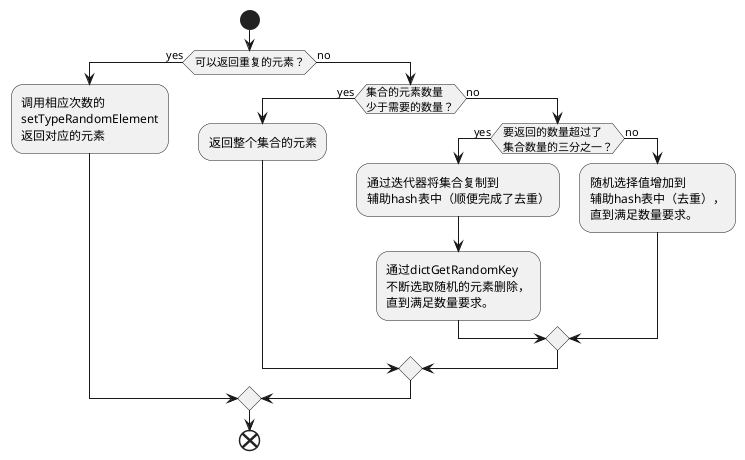

redis集合相关指令的具体实现。

<!--more-->

{}

分类按照命令表的flag来确定，集合的是包含`@set`标签的指令。

*基于redis 6.0*

# 数据结构

集合有两种底层数据结构，第一种是
[整数集合]()
或第二种是
[哈希表]()
。

```c
robj *setTypeCreate(sds value) {
  if (isSdsRepresentableAsLongLong(value,NULL) == C_OK)
    // 最终由string2ll尝试转换来判断
    return createIntsetObject(); // 整数集合
  return createSetObject(); // 其实是初始化一个哈希表
}
```

# 一些普遍的设计思想

类似于`list`类型，对于任何移除元素的指令，
都会检查移除的是否是最后一个元素，
如果是会删除对应的键值对来便于阻塞指令的实现。

另外会将一些复杂的指令的事件由若干简单指令来替代。

# `SADD`/`SREM`

`SADD`向集合中增加一个值，通过`setTypeAdd`来实现。
特别的，如果对应的集合是空，那么初始化一个。
初始化时会根据第一个参数是否是数字来决定使用整数集合或哈希表作为底层结构。
另外，向底层是整数集合的集合插入非整数类型的值或集合中的元素数量过多时，
会调用`setTypeConvert`来将底层的数据结构转换成哈希表。

```c
// src/t_set.c#setTypeAdd
if (isSdsRepresentableAsLongLong(value,&llval) == C_OK) {
  uint8_t success = 0;
  subject->ptr = intsetAdd(subject->ptr,llval,&success);
  if (success) {
    // 检查集合的大小是否过大，并尝试转换
    if (intsetLen(subject->ptr) > server.set_max_intset_entries)
      setTypeConvert(subject,OBJ_ENCODING_HT);
    return 1;
  }
} else {
  // 如果是整数集合且要插入不是整数，那么尝试转换
  setTypeConvert(subject,OBJ_ENCODING_HT);

  serverAssert(dictAdd(subject->ptr,sdsdup(value),NULL) == DICT_OK); // 插入
  return 1;
}
```

`SREM`利用`setTypeRemove`从集合中移除一个特定的元素。
对于哈希表承载的情况，移除后会检查哈希表的负载，
如果需要的话，调用`dictResize`来收缩。
特别的，如果删除后集合为空，那么将该键删除。

# ```SMOVE```

命令先从`src`移除目标元素，如果成功移除，
那么将元素调用`setTypeAdd`增加到`det`集合。
在通知时，这个指令会触发`SREM`和`SADD`。

# ```SISMEMBER```

通过`setTypeIsMember`来实现具体功能。
对于哈希表类型，使用`dictFind`；
对于整数集合，使用`intsetFind`。

# ```SCARD```

平平无奇，```setTypeSize```。

# ```SPOP```

首先利用`setTypeRandomElement`随即选取一个元素，
然后利用`intsetRemove`或`setTypeRemove`来移除。

随机依赖标准库的`random`(哈希表)或`rand`(整数集合)来实现。

# ```SRANDMEMBER```

如果没有指定数量，那么利用`setTypeRandomElement`来返回一个随机的元素**（但不删除）**。

对于要返回多个的情况，使用的是`srandmemberWithCountCommand`，处理了正负参数的不同情况。
如果是返回相同的元素（`count`是负数），通过多次调用`setTypeRandomElement`来实现；
反之（`count`是正数），分为了三种情况来进行处理。
简单看下`srandmemberWithCountCommand`的部分代码：


可以看到，为了减少随机函数的调用，
在获取的数量占集合元素的数量比例较大时，
会用移除代替增加来达到优化的效果。
特别的，三分之一是因为，随机到的元素不会被移除，
继续获取下一个时，会重复。

# `SINTER`/`SINTERSTORE`/`SMEMBERS`

取交集，或者取一个集合的交集（`SMEMBERS`）。
最后都是落到`sinterGenericCommand`实现的。

有几个比较有意思的优化：

- 先根据集合的大小进行排序，先处理数量较小的集合。
- 取交集的方法是遍历最小的集合的元素，不断的和后续的集合进行比较，
  所有的集合都有这个元素时，增加到结果中。

# `SUNION`/`SUNIONSTORE`

并集，由`sunionDiffGenericCommand`实现。

遍历所有的集合，平平无奇。

# `SDIFF`/`SDIFFSTORE`

返回只在第一个集合中出现的元素，由`sunionDiffGenericCommand`实现。

diff有两种算法来实现，复杂度分别为：
1. 第一个集合的长度 * 集合的数量
1. 所有集合的元素

所以实现中首先估计了两种算法的成本，然后就是算法的具体实现。

算法一遍历首个集合的元素，依次与其他集合进行比较，如果都不存在，就加入结果。
算法二将首个集合的元素都加入到辅助hash表，然后遍历后续的集合，
将出现过的元素都尝试从辅助hash表中移除。

# `SSCAN`

最终落到`scanGenericCommand`上来完成。
可以看下这篇文章[scan相关的实现]()。

# `SORT`

与列表的实现类似。可以参考[列表的`SORT`接口实现]()

